# 19. Storefront User Manual

## Document Control

| Field | Value |
|---|---|
| Document Title | ChrisPa Storefront — Customer User Manual |
| Audience | ChrisPa customers (shoppers) |
| Version | 1.0 |
| Date | 14 August 2026 |
| Status | Reflects the storefront as actually built — see [`00-documentation-index.md`](./00-documentation-index.md) |
| Related | [`docs/SRS.md`](./SRS.md), [`20-admin-user-manual.md`](./20-admin-user-manual.md) |

## Welcome to ChrisPa

ChrisPa Scents and Soaps is a Kampala-based natural wellness brand — candles, sea salts, ghee, honey, and
soap bars made from locally-sourced ingredients (goat's milk, honey, herbs, ghee, soywax, beeswax, sea salt,
essential oils). This manual walks through everything you can do on the storefront today, from browsing to
checkout to getting help.

A quick-reference table of what's live today versus what's still on the way is at the end of this manual
([Feature Availability at a Glance](#feature-availability-at-a-glance)) — the rest of the manual focuses on
what you can actually do right now.

## 1. Creating Your Account and Signing In

### Sign up

Go to **Account** in the header (there's no separate "Log In" link — **Account** is the one entry point,
signed in or not) and choose **Create an Account**, or go directly to `/signup`. You'll need:

- Full Name
- Email
- Phone (Uganda format, `+256XXXXXXXXX`)
- Password (at least 8 characters, including at least one number)
- Agreement to the Terms & Privacy Policy

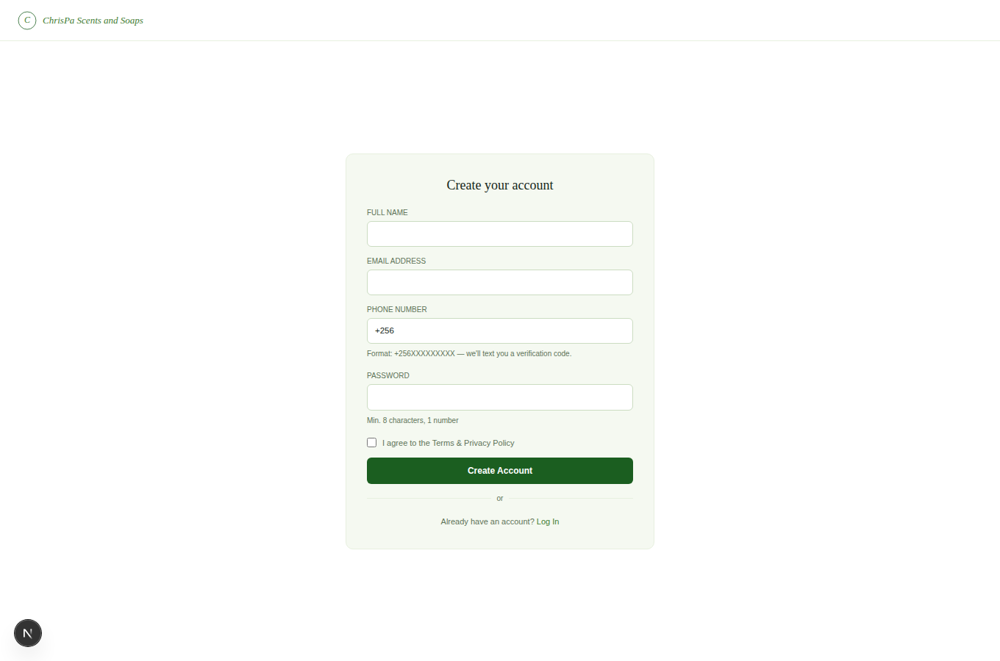

After submitting, your account exists but isn't signed in yet — you'll land on a **Verify your account**
step with two boxes, one for a 6-digit code emailed to you and one texted to your phone. Enter both (in
either order; "Resend code" is there if one doesn't arrive within a minute or so) and you're signed in
automatically the moment the second one's confirmed. Both codes expire after 10 minutes.

**Or, skip all of that** — click **Continue with Google** instead of filling in the form. Since Google's
already confirmed your email address, this creates (or signs into, if you've used it here before) your
account immediately, no password and no verification codes needed.

### Log in

Enter your email or phone and password. If you signed up before finishing the email/phone verification
above, you'll be sent straight back to that **Verify your account** step instead of being let in. If your
account has Two-Factor Authentication turned on, you'll be asked for a 6-digit code from your authenticator
app next.

**Continue with Google**: if you signed up with Google, or just want to skip typing a password, click
**Continue with Google** and pick your account in the popup.

**Biometric Login**: if you've registered a passkey/biometric credential (see [Settings](#settings--security)
below), you can skip your password entirely — type your email/phone, then click **🔒 Log In with Biometric**
and approve it with your device's fingerprint/face unlock or security key.

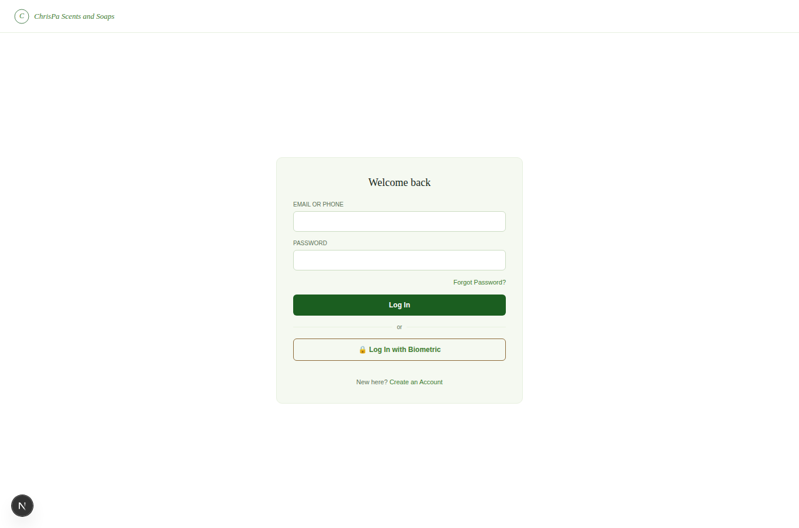

### Forgotten your password?

The Forgot Password / Reset Password screens are not yet wired up to send a reset link — if you're locked
out, contact ChrisPa support to have it resolved manually.

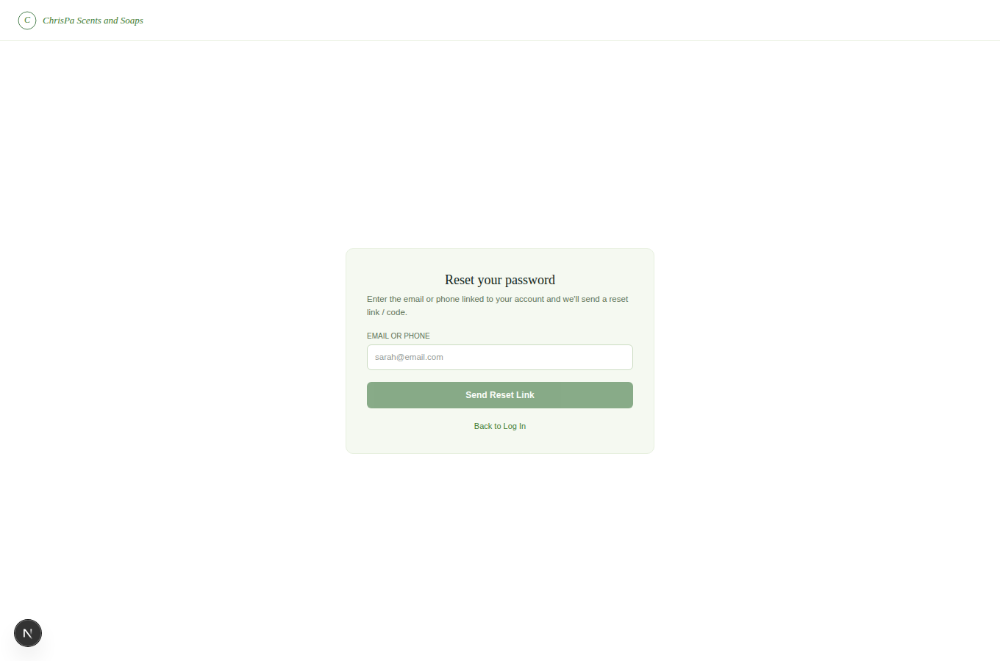

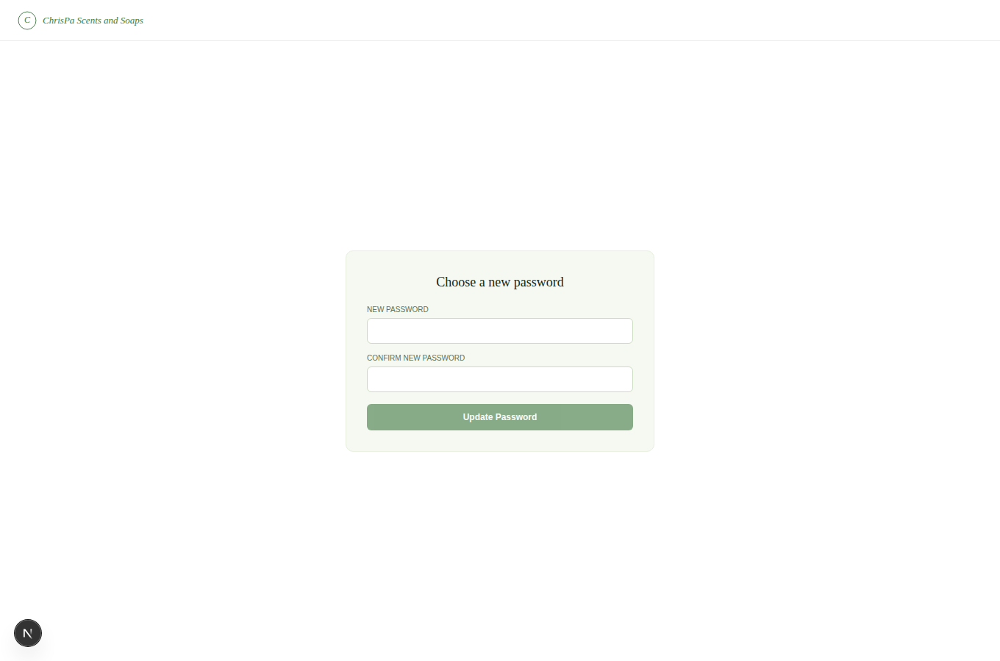

## 2. Finding What You Need

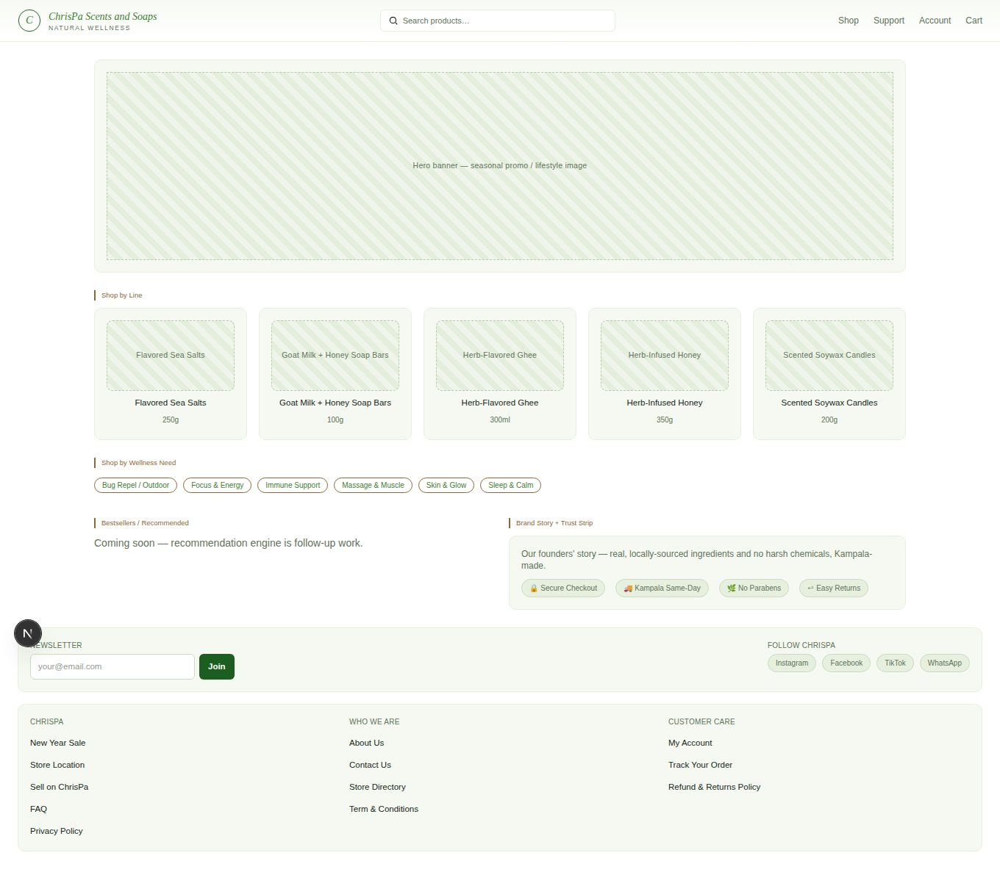

- **Search**: the search box in the header (desktop and mobile) searches product name, scent/flavor notes,
  and health benefits — type a term like "lavender" or "immune" and press Enter.

  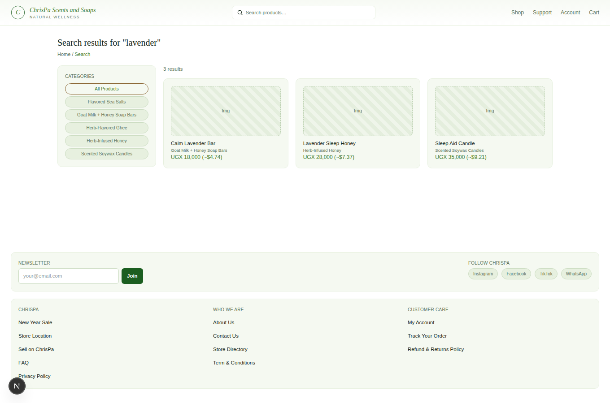

- **Shop by Line**: the homepage's category tiles (Candles, Sea Salts, Ghee, Honey, Soap Bars) take you
  straight to that line's products.

  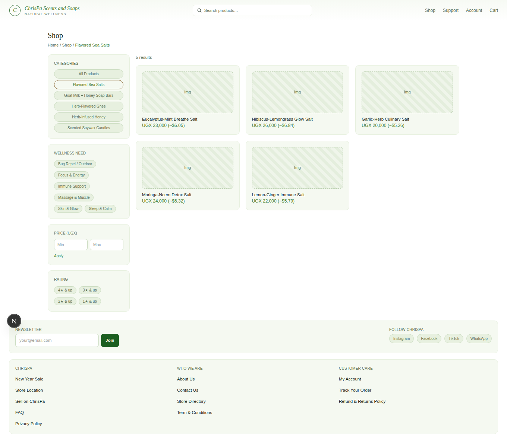
- **Shop by Wellness Need**: below that, a row of chips (Sleep & Calm, Focus & Energy, Skin & Glow, Immune
  Support, Bug Repel / Outdoor, Massage & Muscle) — click any one to jump straight to matching products
  across every product line.
- **The Shop page** (`/shop`, or any category page) has a left-hand sidebar with three real filters that all
  combine together and survive switching category:
  - **Categories** — every product line, plus "All Products."
  - **Wellness Need** — the same tag chips as the homepage.
  - **Price (UGX)** — type a Min and/or Max and click Apply.
  - **Rating** — "4★ & up" through "1★ & up." (ChrisPa doesn't accept product reviews yet, so this filter
    will currently show no matches — it's ready for when reviews launch.)

  Every active filter shows as a removable chip (with a ✕) next to the result count, and a **Clear all
  filters** link appears once more than one is active.

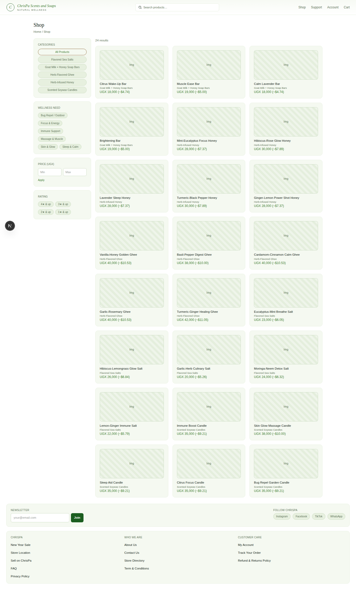

## 3. Product Pages

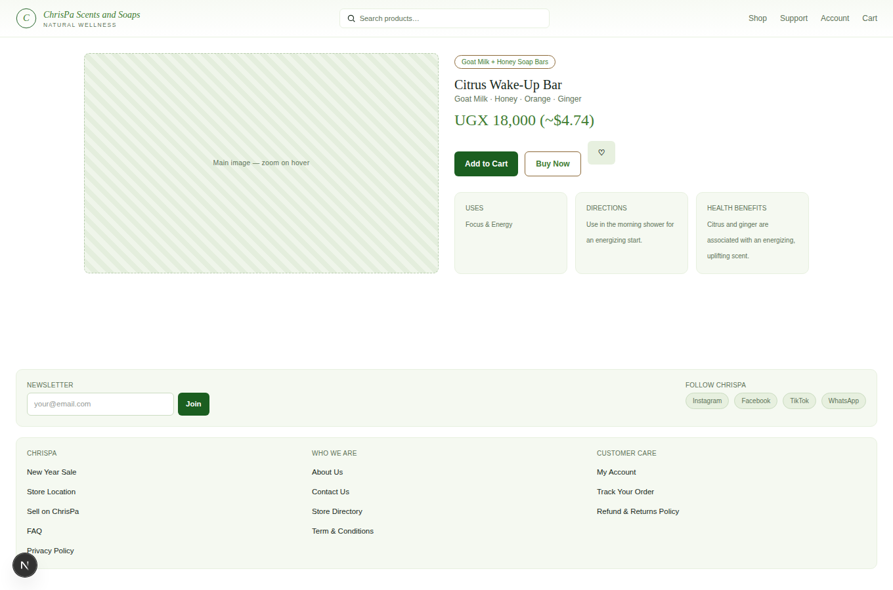

Every price you see on ChrisPa — here, in the Shop grid, your cart, checkout, order history, wishlist, and
your receipt — is shown in both currencies, e.g. `UGX 18,000 (~$4.74)`. UGX is what you're actually charged;
the USD figure is an estimate for shoppers thinking in dollars, using a rate ChrisPa updates manually (not a
live, minute-to-minute exchange rate).

Each product page shows its photos, a **Size** selector if the product comes in more than one size, and
three info panels specific to ChrisPa's catalog:

- **Uses** — the wellness needs this product addresses.
- **Directions** — how to use it.
- **Health Benefits** — what it's traditionally used for.

Pick a size (if applicable) and click **Add to Cart** — you'll be taken straight to your cart. Click the ♡
icon to save it to your **Wishlist** instead (you'll need to be logged in for either).

## 4. Cart and Checkout

### Your cart (`/cart`)

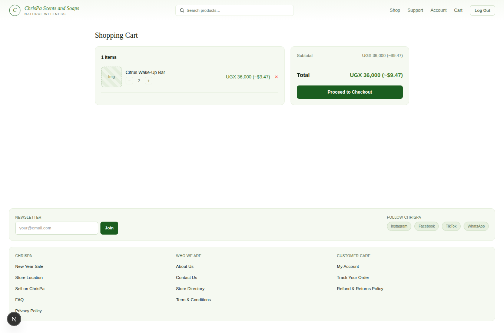

Each line shows the product, a size dropdown (if it has variants), a quantity stepper, and a ✕ to remove it.
The summary panel shows your subtotal and total, with a **Proceed to Checkout** button.

### Checkout

You'll need to be logged in. Fill in:

1. **Shipping details** — recipient name, phone, address, city, and any delivery notes.
2. **Delivery method** — Standard (free), Express (UGX 8,000), or Same-day within Kampala (UGX 12,000).
3. **Promo code** (optional) — if you have a coupon, enter it here.
4. **Payment method** — **Cash on Delivery** is available today. Mobile Money and Card are shown as "coming
   soon" — ChrisPa hasn't connected a payment gateway for them yet.

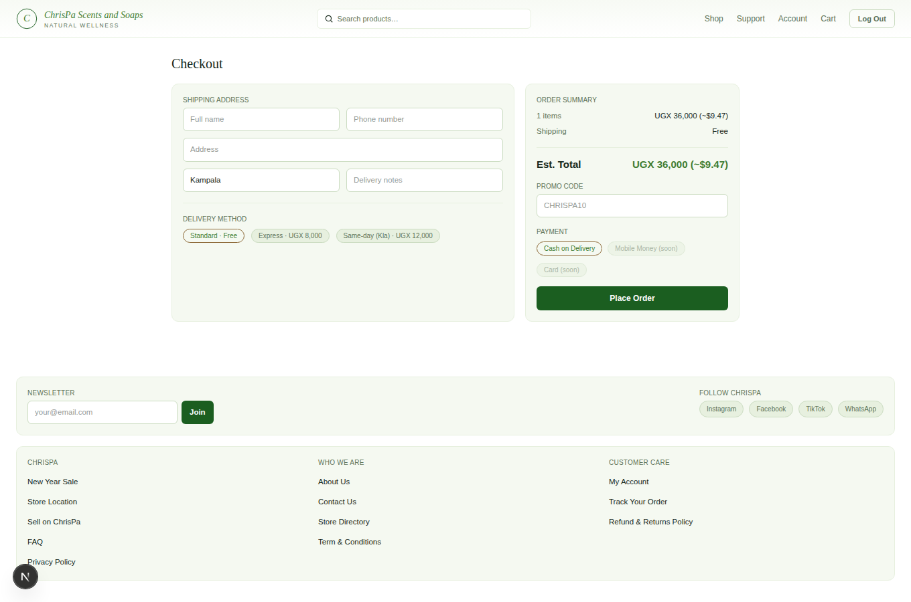

Click **Place Order**. You'll land straight on your new order's tracking page — that page is also your order
confirmation.

## 5. Your Orders

### Order Tracking (`/orders/[order]`)

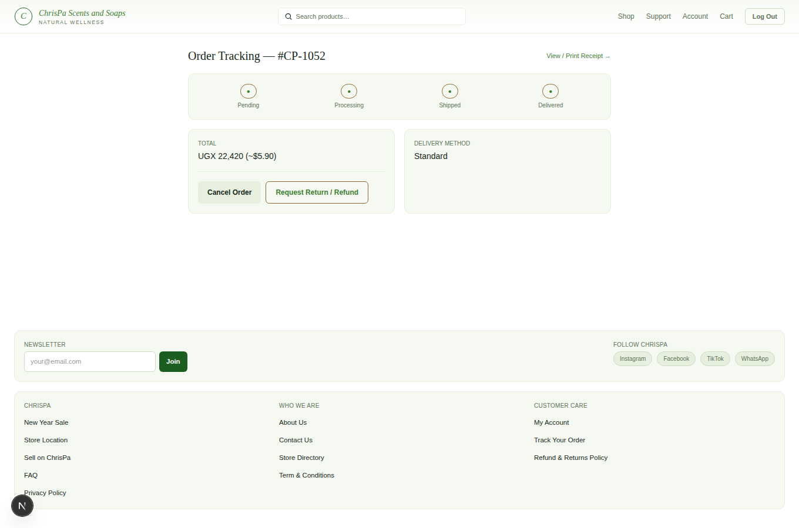

Shows a four-step pipeline — Pending → Processing → Shipped → Delivered — plus your total and delivery
method. Once ChrisPa marks your order **Delivered**, a receipt link appears here.

### Getting your receipt

Your printable receipt isn't available the moment an order is marked Delivered — ChrisPa also wants your own
confirmation that everything arrived in good shape, so both sides have signed off before the receipt is
finalized:

1. From the order tracking page, click **Confirm Receipt →**.
2. Click **✓ I received my order in good condition.**
3. Your receipt unlocks immediately — the link now reads **View / Print Receipt →**.

Your receipt shows ChrisPa's logo, business contact details, every item you ordered (with quantities and
prices), your subtotal/shipping/discount/VAT/total, your payment method, and — since you've just confirmed
it — a **"Received in Good Condition"** stamp with the date and time you confirmed. Click **Print / Save as PDF** to
print it or save it as a PDF through your browser's print dialog (there's no separate download button — this
*is* the download).

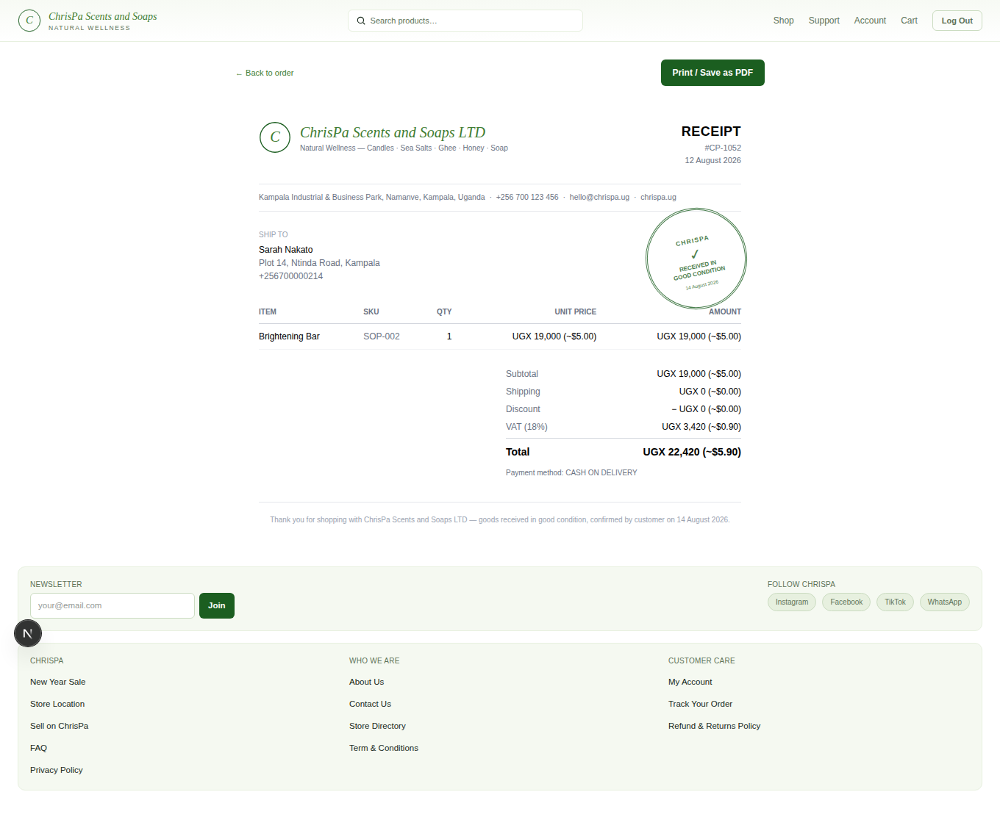

## 6. Your Account

Everything here lives under **Account** in the header, once you're signed in.

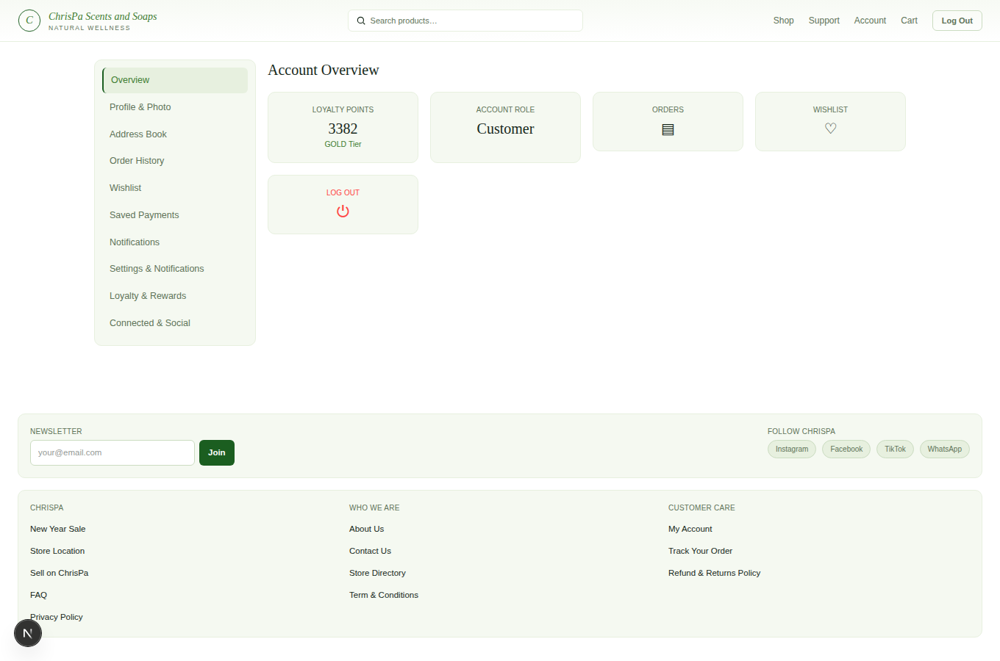

### Profile & Photo

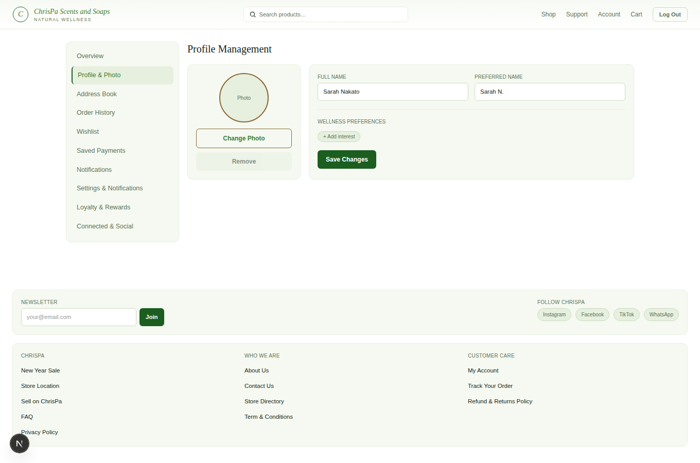

Edit your name and preferred name, upload or remove a profile photo, and manage a "Wellness Preferences" list
of interests (used for future personalization).

### Address Book

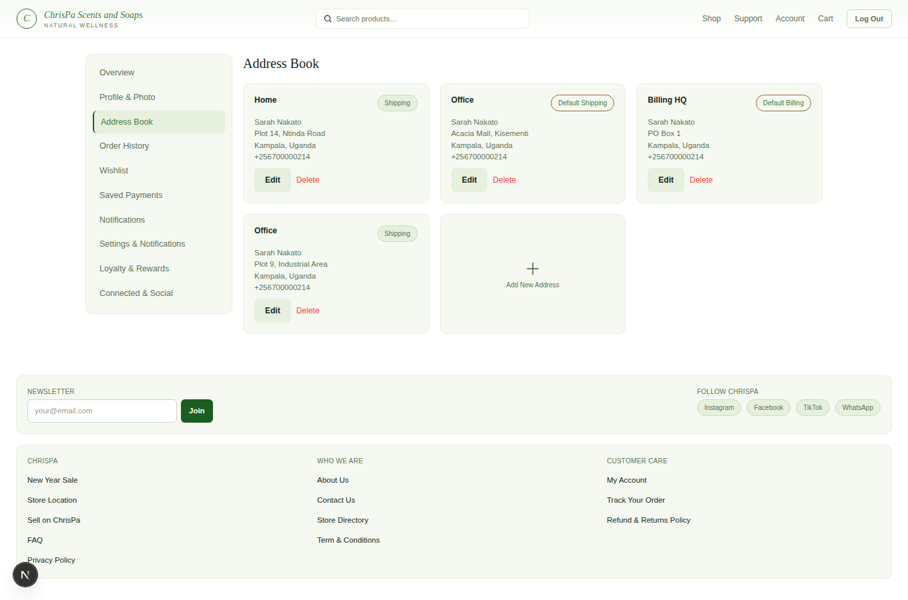

Add, edit, or delete saved addresses — label each one (e.g. "Home," "Office"), mark it Shipping or Billing,
and optionally set it as your default for that type.

### Order History

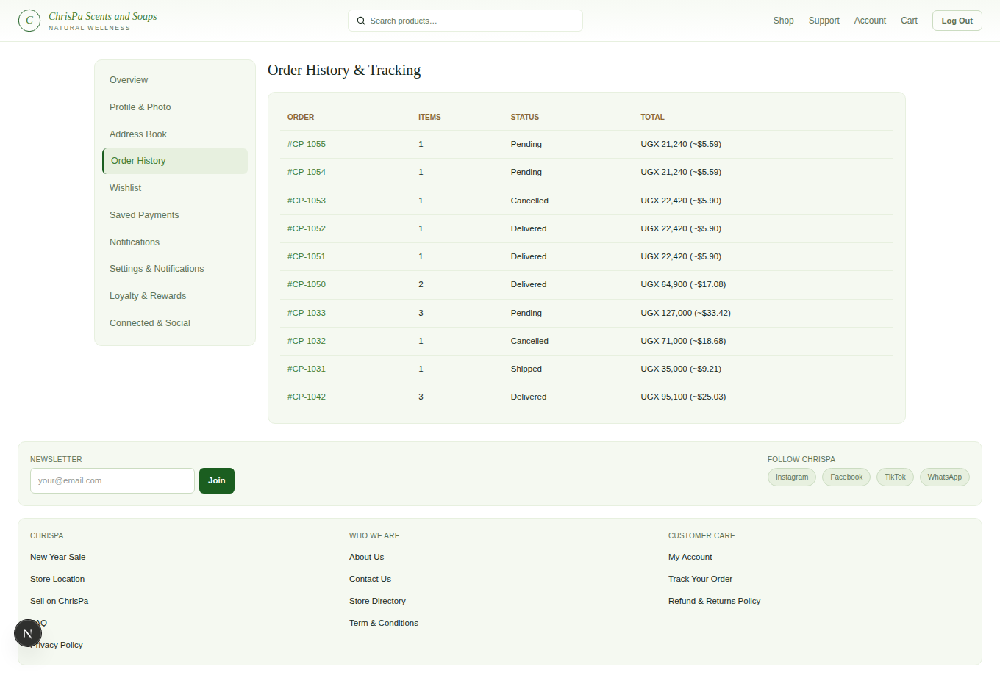

A list of every past order with its status and total — click through to any one for full tracking/receipt
details.

### Wishlist

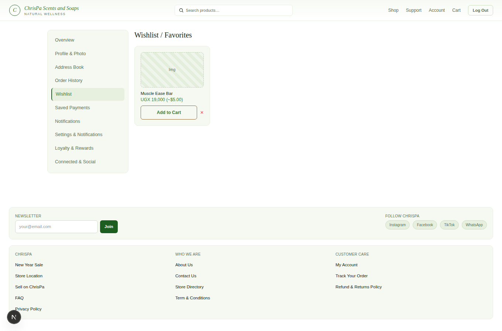

Everything you've saved with the ♡ icon. Add straight to cart or remove items from here.

### Saved Payment Methods

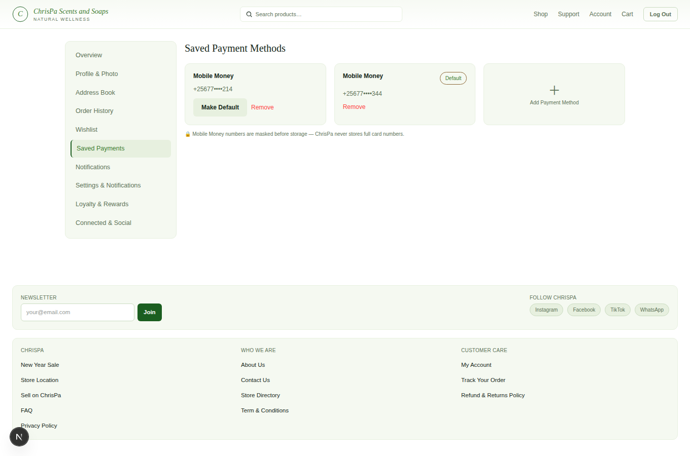

Only **Mobile Money** numbers can be saved today — enter your number and it's saved (masked) for faster
checkout later. Card and PayPal are shown but not yet available (no payment gateway connected for them yet).
Set any saved method as your default, or remove it.

### Loyalty & Rewards

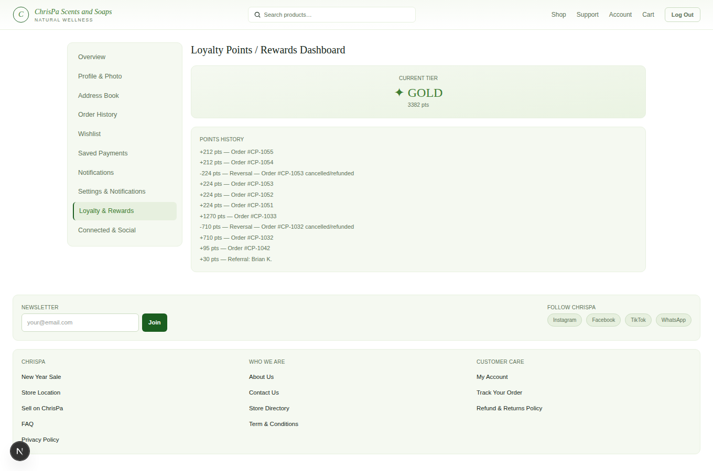

Shows your current tier and points balance, plus a history of how you earned them. You earn **10 points for
every UGX 1,000 spent**, credited automatically as soon as an order is placed. Redeeming points isn't
available yet — think of this page as your running rewards statement for now, with redemption coming later.

### Settings & Notifications

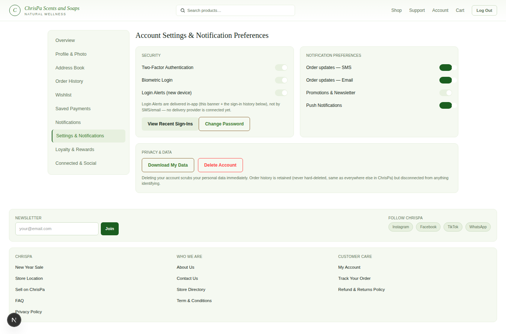

- **Two-Factor Authentication**: turn on and scan the QR code with your authenticator app (Google
  Authenticator, Authy, etc.), then confirm with the 6-digit code it shows you.
- **Biometric Login**: register your device's fingerprint/face unlock or a security key for passwordless
  sign-in (see [Log in](#log-in) above).
- **Login Alerts**: get notified in-app (right here, plus a "Recent Sign-Ins" history) whenever your account
  is signed into from a new device — this doesn't currently send an email or SMS, just the in-app alert.
- **Change Password**: enter your current password and a new one.
- **Notification Preferences**: toggle Order Updates (SMS), Order Updates (Email), Promotions & Newsletter,
  and Push Notifications. (These save your preference; nothing sends on any of these toggles today — email
  and SMS delivery are only wired up for the verification codes you get at signup and for newsletter
  campaigns (see [Notifications](#notifications) below), not for order-update/push triggers yet, and there's
  no push notification service connected at all.)
- **Download My Data**: get a JSON file of everything ChrisPa holds about you — profile, addresses, orders,
  saved payment methods (masked), wishlist, reviews, support tickets, and loyalty history.
- **Delete Account**: type your password and the word **DELETE** to confirm. This immediately removes your
  addresses, saved payment methods, cart, wishlist, and login/biometric data, and signs you out everywhere.
  Your order history is kept (for receipts, returns, and ChrisPa's own accounting records) but is no longer
  linked to your personal information. **This can't be undone.**

### Notifications

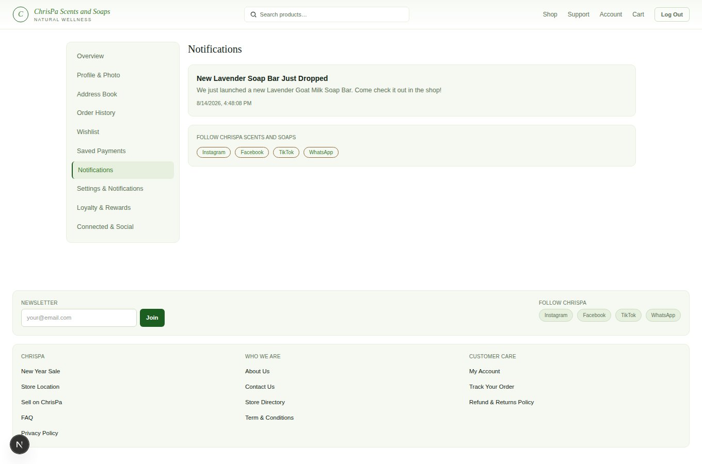

Your account has a **Notifications** inbox (its own item in the account sidebar, with a badge showing how
many are unread). Today the only thing that lands here is a ChrisPa **newsletter** — when ChrisPa's team
sends one out, you'll see it listed with its subject, message, and a "New" tag until you open it. Click
**Mark read** on one, or **Mark all read** at the top, to clear the badge. Every newsletter you get here is
also emailed to you at the address you signed up with, and the page includes a **Follow ChrisPa** card
linking out to ChrisPa's social accounts, so you can review the update and follow/connect with ChrisPa in the
same place. (This inbox is built generically, so other kinds of alerts — order updates, etc. — may start
appearing here in the future; right now newsletters are the only kind.)

### Connected & Social

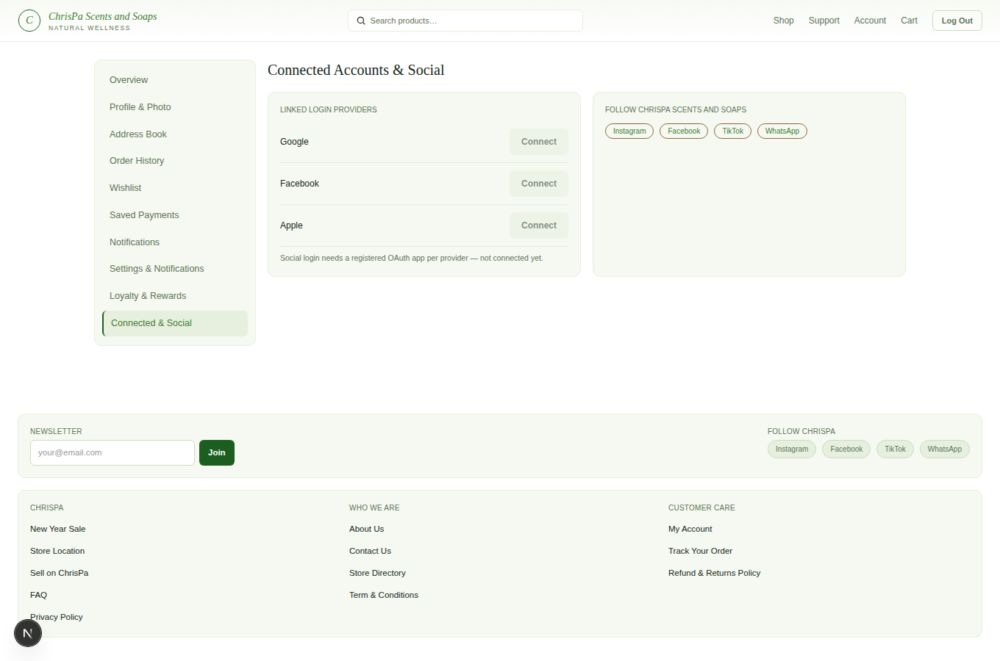

**Follow ChrisPa** — real, clickable links to ChrisPa's social media accounts (Instagram, Facebook, TikTok,
WhatsApp, and whatever else ChrisPa adds) appear here, in the footer on every page, and on every newsletter
you get (email and in-app — see [Notifications](#notifications) above). These are managed by ChrisPa's team,
so which accounts show up can change at any time.

**Newsletter** — the footer on every page (not this Settings page — it's open to anyone, signed in or not)
has a working email box and **Join** button. Enter your email and submit to be added to ChrisPa's mailing
list; there's no confirmation email sent, just an inline "Subscribed — thank you!" once it goes through.
When ChrisPa's team sends a campaign to that list, you'll get it by email, and — if the email you subscribed
with matches your ChrisPa account — as an in-app notification too (see [Notifications](#notifications)).

**Linked Login Providers**: a Connect/Disconnect control here, for adding Google/Facebook/Apple sign-in
*to an account you already created another way*, is reserved for later — not built yet. This is different
from signing up or logging in *with* Google in the first place, which already works (see
[Creating Your Account and Signing In](#1-creating-your-account-and-signing-in)) — Facebook and Apple aren't
available for either use yet.

## 7. Getting Help

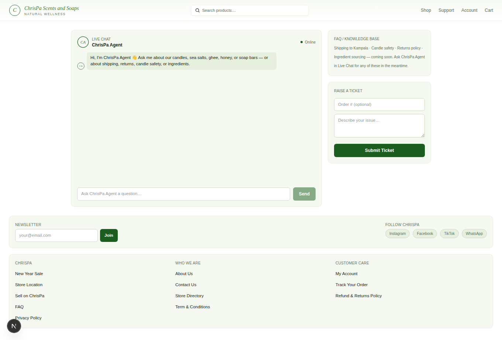

- **Live Chat** — the "ChrisPa Agent" widget on the Support page answers common questions about products,
  candle safety, shipping, returns, and ingredients instantly, any time, no login needed. It's a
  keyword-matched assistant, not a live human — if it can't help, it'll point you to raising a ticket.
- **Raise a Ticket** — from the Support page, describe your issue (and your order number, if relevant) and
  submit. A ChrisPa staff member will respond directly on your ticket.
- **Your ticket conversation** — every ticket you raise appears in a **My Tickets** list on the Support page.
  Open one to see the full back-and-forth with the staff member helping you (their real name, not just
  "Support"), each message timestamped, and you can reply right there as long as the ticket's still open. A
  closed ticket is locked — raise a new one if you need more help.

  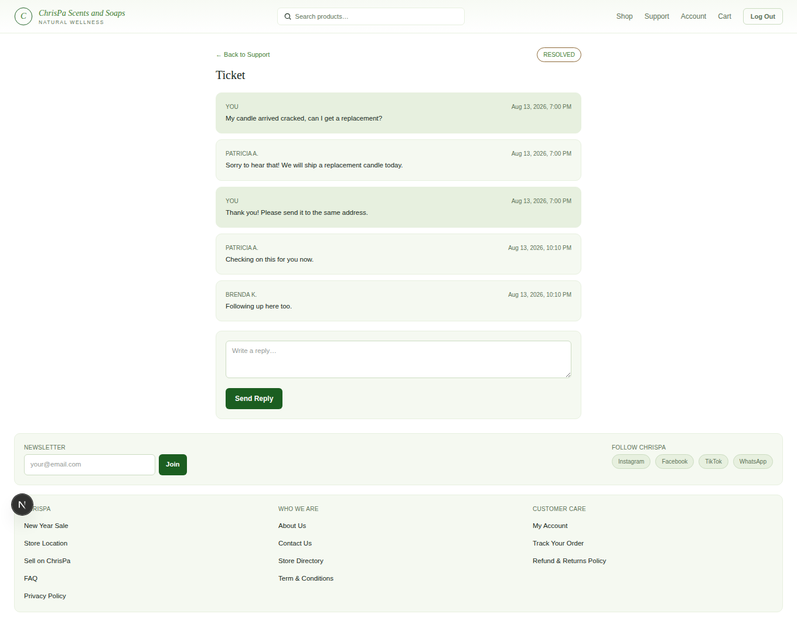

### The Footer

Every page has a footer with the Newsletter box and Follow ChrisPa links described above, plus a 3-column
site map — every link here is real and goes somewhere:

- **ChrisPa** — New Year Sale, Store Location, Sell on ChrisPa, FAQ (jumps straight to the FAQ card on the
  Support page), Privacy Policy
- **Who We Are** — About Us, Contact Us, Store Directory, Term & Conditions
- **Customer Care** — My Account, Track Your Order (your Order History — there's no separate "enter your
  order number" lookup), Refund & Returns Policy

Most of these (everything except FAQ, My Account, and Track Your Order) are plain content pages ChrisPa's
team publishes — title + text body, no rich formatting — rendered at `/pages/[slug]`.

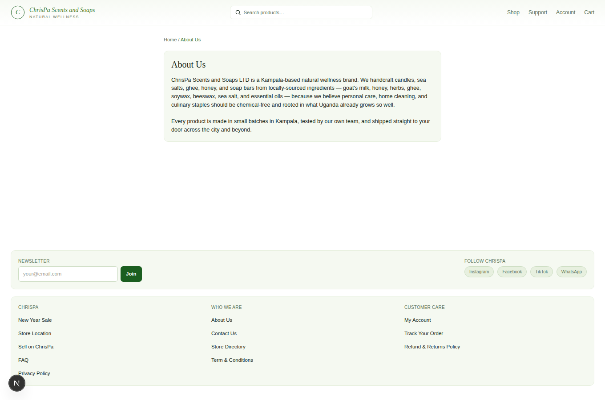

## Feature Availability at a Glance

| Area | Available now | Coming soon |
|---|---|---|
| Login | Password, 2FA, biometric/passkey, Google sign-in/sign-up, email+SMS verification at signup | Forgot/reset password, Facebook/Apple sign-in, linking a social login to an existing account |
| Checkout payment | Cash on Delivery | Mobile Money, Card |
| Product page | Photos, size selection, Add to Cart, Wishlist | "Buy Now" shortcut, photo zoom/click-to-swap |
| Order actions | Tracking, receipt (after delivery + your confirmation) | Cancel Order, Request Return/Refund |
| Loyalty | Earning points, viewing balance/history | Redeeming points, referral/birthday bonuses |
| Notifications | In-app login alerts, saved preferences, newsletter inbox (email + in-app, with unread badge) | Order-update/push delivery |
| Reviews | — | Leaving a product review or rating |
| Social | Following ChrisPa's social accounts (footer + Connected & Social + every newsletter), footer newsletter signup, real newsletter campaigns (email + in-app) | Linking your own Google/Facebook/Apple login |
