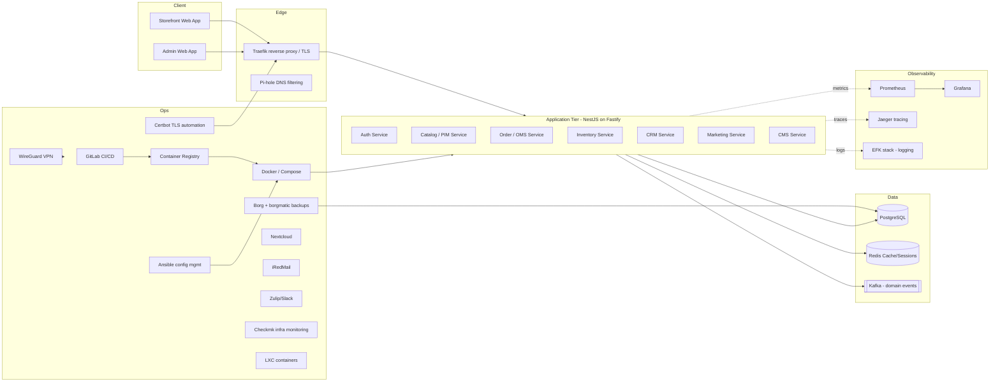

# Software Requirements Specification
## ChrisPa Scents and Soaps LTD — E-Commerce Platform

| | |
|---|---|
| **Document** | Software Requirements Specification (SRS) |
| **Version** | 1.0 — Draft |
| **Status** | Derived from approved UX wireframes; pending stakeholder sign-off |
| **Source material** | 8 HTML wireframes in `mockUps/` (Frontend ×2, Admin, Login, SignUp, ForgotPassword, ResetPassword, MyAccount) |
| **Prepared for** | ChrisPa Scents and Soaps LTD |

---

## 1. Purpose & Scope

This document specifies the functional, non-functional, and technical requirements for the ChrisPa e-commerce platform: a customer-facing storefront, account/auth system, and an admin back-office, covering everything represented in the approved wireframes.

**In scope (v1):** customer storefront, authentication, account management, admin back-office, and the supporting infrastructure needed to run them in production.

**Out of scope (v1):** anything not represented in the wireframes — e.g. point-of-sale (in-store), multi-currency beyond UGX, multi-country/international shipping, native mobile apps, and the masterclasses/facility-care service lines described in §2's Business Context (no FR-IDs, data model, or UI exist for these yet). These may become future phases, the same way HR was added later outside the original wireframes.

---

## 2. Business Context

- **Company:** ChrisPa Scents and Soaps LTD, based in Kampala, Uganda.
- **Problem:** Many commercial personal-care, home-cleaning, and culinary products contain harsh chemicals,
  artificial fragrances, and toxins that can harm skin, health, and the environment. Consumers are also
  looking for natural ways to manage stress, prevent bug-borne diseases, and preserve food (vegetables,
  herbs, medicinal plants) without compromising quality — access to natural, healthy, effective alternatives
  is limited.
- **Solution:** A range of natural, organic, and therapeutic products made from locally-sourced ingredients —
  goat's milk, honey, herbs, ghee, soywax, beeswax, sea salt, and essential oils — covering personal care,
  home cleaning, culinary, and wellness needs, plus specialized masterclasses and facility-care services that
  educate and empower customers to adopt healthier habits and maintain clean, safe spaces. **Masterclasses
  and facility-care services are business-level offerings, not yet represented in this SRS's functional
  requirements or the platform's data model** — see §1's Out of Scope note (out of scope for v1; a candidate
  for a future phase, the same way HR was added later outside the original wireframes).
- **Target market:**
  1. Health-conscious individuals
  2. Eco-friendly consumers
  3. People seeking natural wellness solutions
  4. Hotels, spas, and wellness centers
  5. Middle- to upper-income households in urban areas
- **Catalog:** 5 product lines, ~25–27 SKUs at launch:
  | Line | Unit size | SKUs |
  |---|---|---|
  | Scented Soywax Candles | 200g | 5 |
  | Flavored Sea Salts | 250g | 5 |
  | Herb-Flavored Ghee | 300ml | 5 |
  | Herb-Infused Honey | 350g | 5 |
  | Goat Milk + Honey Soap Bars | 100g | 5 |
- **Currency:** Uganda Shillings (UGX) only, v1.
- **Fulfillment:** Two warehouses (Kampala Central, Entebbe Hub); local courier partner (e.g. SafeBoda Logistics) for last-mile, with a Kampala same-day option.
- **Payments:** Mobile Money (primary), card, cash on delivery.
- **Customer segments:** Retail (Standard / Gold loyalty tiers) and Wholesale/Corporate accounts (SSO-eligible).
- **Differentiator:** cross-line "Shop by Wellness Need" discovery (Sleep & Calm, Focus & Energy, Skin & Glow, Immune Support, Bug Repel/Outdoor, Massage & Muscle) and structured **Uses / Directions / Health Benefits** data on every product — this drives both the PDP layout and the PIM schema.

---

## 3. Glossary

| Term | Meaning |
|---|---|
| PDP | Product Detail Page |
| PLP | Product Listing Page (category/shop grid) |
| PIM | Product Information Management (admin product catalog module) |
| OMS | Order Management System |
| CRM | Customer Relationship Management |
| CMS | Content Management System (site builder) |
| RBAC | Role-Based Access Control |
| MoMo | Mobile Money |
| SSO | Single Sign-On |
| 2FA | Two-Factor Authentication |
| LTV / CAC | Lifetime Value / Customer Acquisition Cost |
| RFM | Recency, Frequency, Monetary (customer segmentation model) |
| SKU | Stock Keeping Unit |

---

## 4. User Roles

| Role | Description |
|---|---|
| Guest | Unauthenticated shopper; can browse, add to cart, guest-checkout |
| Customer (Standard) | Registered retail customer |
| Customer (Gold / VIP) | Loyalty-tier customer with elevated perks |
| Customer (Wholesale/Corporate) | B2B account, SSO-eligible, distinct pricing/terms (implied) |
| Store Owner | Full admin access (from wireframe: "Chris P. — Owner") |
| Store Manager | Broad admin access, minus destructive/owner-only actions |
| Fulfillment Staff | Order Management + Inventory access only |
| Support Agent | Handles live chat / tickets (implied by Help & Support module) |

---

## 5. Functional Requirements

Requirements are grouped to match the **Feature groups** already annotated in the wireframes, so each requirement is traceable back to its source screen.

### 5.1 Client / Frontend

**FR-1 — Homepage** (`page-home`)
- FR-1.1 CMS-managed hero banner/slider (multiple slides, dot navigation). **Partially real** — the hero image
  is now CMS-managed (Admin → CMS / Site Builder → Active Banners, see FR-27.1), replacing the previous static
  placeholder; it shows the single lowest-`sortOrder` active banner, not a multi-slide rotation with dot
  navigation, which remains not implemented.
- FR-1.2 "Shop by Line" — 5 category entry tiles (Candles, Sea Salts, Ghee, Honey, Soap Bars), each showing SKU count and unit size. Each tile links to `/shop/[line]`; the header/mobile nav's "Shop" link was previously hardcoded to one specific line (`/shop/candles`) rather than a general entry point — fixed to link to a real `/shop` landing page (every active product, all lines) instead. A site-wide product search box (name, scent/flavor notes, health benefits) now also lives in the header — on every page, not just `/shop` — submitting to `/search?q=…`, which reuses the Shop page's category-sidebar/grid layout with a "Search results for…" heading. The header previously showed both a standalone "Log In" link and a separate "Account" link for a signed-out visitor; the "Log In" link has been removed and "Account" is now the single entry point for both a signed-in and a signed-out customer, always routing to `/account` — see FR-11 for what that page now shows a signed-out visitor. "Log Out" is unaffected and still shown once signed in.
- FR-1.3 "Shop by Wellness Need" — chip-based cross-line discovery, driven by "Uses" tags on product records.
  **Real, built** (previously a static, non-clickable display — every chip rendered identically with no `href`
  and no click handler, so nothing happened when clicked; fixed directly per explicit user request that this
  section be "active"). Each chip now links to `/shop?wellness=<tag label>`, which filters the Shop grid down
  to only products carrying that wellness tag — see FR-3.2, which this reuses rather than duplicating.
- FR-1.4 AI-powered bestseller/recommendation carousel.
- FR-1.5 Brand story block + trust-signal strip (secure checkout, same-day Kampala delivery, no-parabens, easy returns).
- FR-1.6 Footer: newsletter signup, social links (Instagram, Facebook, TikTok, WhatsApp), a 3-column link
  sitemap, legal pages.
  **Social links are real, admin-managed** — see FR-19.2. **Newsletter signup is now real** too — the
  placeholder `your@email.com` box became a working email input + Join button (`NewsletterSignupForm`, a
  small client component embedded inside the otherwise server-rendered `SiteFooter`), posting to the public
  `POST /newsletter/subscribe` — see FR-26.4 for the full backend description.

  **Footer link sitemap (added later, direct user request — not in the original wireframe, which only shows
  the newsletter/social/legal row above).** Three columns, every link real and clickable
  (`apps/storefront/src/components/site-footer.tsx`):
  - **ChrisPa** — New Year Sale, Store Location, Sell on ChrisPa, FAQ, Privacy Policy
  - **Who We Are** — About Us, Contact Us, Store Directory, Term & Conditions
  - **Customer Care** — My Account, Track Your Order, Refund & Returns Policy

  Nine of these (everything except FAQ/My Account/Track Your Order) are backed by real `CmsPage` rows — the
  same Static Pages mechanism as FR-27.1, rendered at `/pages/[slug]` — so their content is fully editable at
  Admin → CMS / Site Builder → Published Pages without a code change. This also finally gives Privacy Policy
  and Term & Conditions real destinations — the previous static, non-clickable "Privacy · Terms · Cookie
  Settings" text (with no content behind it) is gone. FAQ deep-links to the Support page's FAQ card
  (`/support#faq`, FR-7.2); My Account links to `/account`; Track Your Order links to `/account/orders` (Order
  History) since there's no anonymous "enter your order number" lookup in this codebase — order tracking
  otherwise requires either the order's own URL or being signed in, see FR-14.

**FR-2 — Product Detail Page (PDP)** (`page-pdp`)
- FR-2.1 Image gallery: main image with zoom, thumbnails, 360° view slot. Main image + up to 4 thumbnails now render the product's actual uploaded photos (`ProductMedia`, via FR-22.5's real upload) rather than a gray placeholder — a real, previously-missing rendering gap, fixed directly. Zoom-on-hover, click-to-swap-main-image, and the 360° view slot are still **not implemented** — a static, non-interactive gallery for now, follow-up work for the interactive version.
- FR-2.2 Variant selection (size), quantity stepper, stock-status indicator.
- FR-2.3 Add to Cart, Buy Now, Wishlist (♡) actions. The listed price above these actions is dual-currency (UGX + USD estimate) — see FR-3.5.
- FR-2.4 "Notify Me — Back in Stock" for out-of-stock items.
- FR-2.5 Structured product data unique to ChrisPa's catalog: **Uses**, **Directions**, **Health Benefits** — each rendered as its own panel.
- FR-2.6 Ratings/reviews summary + Q&A count; review list with photo attachments. **Not implemented** — the
  `Review` model exists and `getProductBySlug` already returns a product's latest 20 reviews, but there is no
  review-submission endpoint anywhere in the API, so no real review can ever be created; noted concretely
  while building FR-3.2's Rating filter, which is real but has nothing to filter against until this exists.
- FR-2.7 "Frequently Bought Together" bundle suggestion with bundle pricing.

**FR-3 — Shop / Category (PLP)** (`page-plp`)
- FR-3.1 Breadcrumb navigation. Shows the real category name (from `/catalog/product-lines`), not the raw URL slug. A **Categories** sidebar (every line, plus "All Products", current one highlighted) is shown on every shop page — `/shop` (all active products, any line) and `/shop/[line]` (one line) share one component (`ShopView`) specifically so switching categories is one click, not a trip back to the homepage; an unknown line slug now 404s instead of silently showing "0 results." This goes beyond the wireframe's plain breadcrumb, added because a breadcrumb alone didn't let a customer actually change category from within the shop page.
- FR-3.2 Filters: Product Line, Wellness Use, Price range, Rating. **Wellness Use is now real, built** —
  `GET /catalog/products` already accepted a `?wellness=<label>` param (matched against `WellnessTag.label`
  via the `ProductWellnessTag` join table) that the storefront simply never called; a **Wellness Need** panel
  now sits in the Shop sidebar (`ShopView`, alongside the existing Categories panel) listing every tag as a
  toggleable chip — clicking one filters the grid, clicking the active one (or the "✕" chip shown next to the
  result count) clears it, and switching category/line while a wellness filter is active preserves it (both
  query params combine in the same `where` clause, ANDed). No new route or schema change was needed —
  `WellnessTag` still has no `slug` field, so the filter matches on the (unique) label, URL-encoded.
  **Price range and Rating are now real, built too** — a `?minPrice=`/`?maxPrice=` pair filters
  `Product.priceUgx` directly (a plain GET `<form>` in the sidebar, no client-side JS); `?rating=N` filters to
  products whose average `Review.rating` is `N` or higher, computed via `Review.groupBy({ by: ['productId'],
  _avg: { rating: true }, having: ... })` since `Product` has no denormalized rating column and nothing writes
  one. **Honest caveat**: there is no review-submission endpoint anywhere in this codebase yet (`Review` rows
  can currently only be seeded directly), so the Rating filter is a real, correct query that will return no
  matches until reviews actually exist — not a fake filter, just one with nothing to filter yet. All three
  filters (Wellness Need, Price, Rating) combine together and survive switching category, and every active one
  shows as a removable chip next to the result count ("Clear all filters" once more than one is active).
- FR-3.3 Grid/List view toggle; sort control (Relevance, etc.). **Not implemented** — grid view only, no sort control.
- FR-3.4 Result count; "Recently viewed / Compare" tray. Result count is implemented (`"N results"`); "Recently viewed / Compare" is **not** — follow-up work.
- **FR-3.5 Dual-currency price display (added later, direct user request: "products in shop section and other
  sections to be listed in both Uganda Shillings (UGX) and United States Dollar($)").** Every customer-facing
  listed price — shop grid (this page), product detail (FR-2.3), cart line items/subtotal/total (FR-4.4),
  checkout order summary (FR-5.7), wishlist (FR-15.1), order tracking total (FR-14) and the printable order
  receipt/invoice (§21.5) — now renders as `UGX 18,000 (~$4.74)` via a single shared helper,
  `formatDualPrice()` (`apps/storefront/src/lib/api.ts`). **UGX remains the store's one real, charged
  currency** — every amount sent to the API (cart, checkout, coupon, order totals) is still a plain UGX
  integer; the USD figure is a read-only display convenience computed client-side, never something a customer
  pays with or the API accepts. The conversion rate (`USD_PER_UGX`) is a **static, manually-set constant** —
  there is no live FX-rate feed wired in anywhere in this codebase, the same "no external provider connected
  yet" constraint already documented for payments/email/SMS elsewhere (§7, §9). The Finance module's
  `LegalEntity.currentGroupFxRate` (§20 FIN-FR-4) is a separate, deliberately un-reused rate — it's an
  admin-only figure scoped to multi-entity accounting consolidation between a legal entity's functional
  currency and the group's reporting currency, not a general customer-facing rate, and wiring customer prices
  to it would tie storefront display to an accounting concern with a different purpose and a different update
  cadence. The Shop sidebar's **Price (UGX)** filter inputs and the "active filter" chip echoing the chosen
  min/max range are deliberately left UGX-only — they're a filter control the customer types into, not a
  "listed price," so dual-currency formatting doesn't apply there.

**FR-4 — Cart** (`page-cart`)
- FR-4.1 Line-item list with thumbnail, name, variant, qty stepper, remove.
- FR-4.2 "Save for later" list.
- FR-4.3 Promo code entry + apply.
- FR-4.4 Order summary: subtotal, estimated shipping, discount, total. All dual-currency (UGX + USD estimate) — see FR-3.5.
- FR-4.5 Cart persists to the customer's account and syncs across devices/sessions.
- FR-4.6 Editing a line item covers quantity and, for products with sizes/variants, switching the variant — both recompute that line's price (base price + the variant's price delta) live rather than the wireframe's static display. Switching to a variant another line in the same cart already holds merges the two lines (same dedupe rule as adding a duplicate item) instead of leaving two rows for one product+variant pair. The unit price itself is never a customer-editable field — it's always derived from the product/variant record, never a value the client can submit, so a tampered request can't check out at an arbitrary price.

**FR-5 — Checkout** (`page-checkout`)
- FR-5.1 Multi-step flow: Shipping → Payment → Review.
- FR-5.2 Guest checkout option alongside authenticated checkout.
- FR-5.3 Shipping address form with address auto-complete; Kampala-specific city field; delivery notes.
- FR-5.4 Delivery method selection: Standard (free), Express, Same-day (Kampala) — each with its own price.
- FR-5.5 Delivery time-slot selection.
- FR-5.6 Payment method selection: Mobile Money, Card, Cash on Delivery.
- FR-5.7 Order summary sidebar with running total. Dual-currency (UGX + USD estimate) — see FR-3.5.
- FR-5.8 PCI-DSS-compliant payment processing; no raw card data touches ChrisPa servers.

**FR-6 — Order Tracking** (`page-order-track`)
- FR-6.1 Visual status pipeline: Placed → Packed → Shipped → Delivered.
- FR-6.2 Carrier name + tracking number + ETA window.
- FR-6.3 Cancel Order and Request Return/Refund actions (state-dependent). **Not implemented** — both buttons
  render on the order-tracking page but have no click handler; noticed while building FR-6.5 just below, not
  otherwise part of this pass.
- FR-6.4 Multi-channel delivery notifications (SMS + Email + Push).
- FR-6.5 Downloadable PDF invoice. **Real, built** — see PAY-FR-5 (§21.5) for the full design: a
  browser-printable receipt (not a generated PDF file) carrying ChrisPa's logo, company details, itemized
  products, and — once the customer confirms the goods arrived in good condition — a virtual "received in good
  condition" stamp. The order-tracking page's receipt link only appears once the order is `DELIVERED`.

**FR-7 — Help & Support** (`page-support`)
- FR-7.1 **AI live-chat assistant, online-status indicator — real, built.** Branded as **"ChrisPa Agent"**
  with a circular avatar (`AgentAvatar` in `components/ai-chat-widget.tsx` — the same green-stroke,
  serif-italic mark as the site header's "C" logo, so the assistant reads as a ChrisPa-branded persona, not
  a generic bot icon), shown both in the chat widget's header and next to every assistant reply bubble. The
  wireframe's original placeholder name for this feature was "Pa" — renamed to "ChrisPa Agent" with the
  avatar treatment per explicit user request. Calls `POST /chat/message` (`modules/chat`, public — no login
  required, matching the wireframe's Live Chat card being open to any visitor).
  - **A basic, keyword-matched FAQ bot, not an LLM** — `ChatService.reply()` matches the incoming message
    against a fixed table of keyword → canned-reply entries (`FAQ_ENTRIES` in `chat.service.ts`, covering
    product lines, candle safety, shipping, returns, and ingredient sourcing — the same categories FR-7.2
    lists) and returns the first match, or a fallback reply pointing at the "Submit a Ticket" form if
    nothing matches. **This is a deliberate downgrade from an earlier Claude-API-backed version**, made per
    explicit user decision specifically to need no external service, no `ANTHROPIC_API_KEY`/credentials, and
    no ongoing per-message cost — trading conversational range for zero setup and zero cost. There is
    nothing to "configure"; it works out of the box in every environment. `@anthropic-ai/sdk` was removed
    from `apps/api/package.json` along with the `anthropic` config block and `ANTHROPIC_API_KEY` from
    `.env`/`.env.example`, since nothing references them anymore.
  - **Still never claims to know a customer's account/order/payment details** — the same behavioral boundary
    as the earlier LLM version, just enforced by an explicit keyword check (`ACCOUNT_SPECIFIC_KEYWORDS`) that
    routes anything sounding account-specific ("my order", "track", "password", etc.) to a fixed reply
    pointing at the real "Submit a Ticket" form (FR-7.3), rather than a system-prompt instruction.
  - **Chat is ephemeral, not persisted** — a separate, still-standing explicit user decision from the earlier
    build. There is no `ChatConversation`/`ChatMessage` table; the widget keeps the conversation only in
    React state and it resets on page reload. Since `ChatService.reply()` only ever needs the current
    message (no LLM to give conversational context to), the API request body was simplified to just
    `{ message }` — the wire format no longer carries a `history` array at all.
  - No per-route rate limiting beyond the app-wide default (100 req/min/IP, §6) — the earlier tighter
    10/min/IP throttle existed specifically because each request was a billed external API call; a local
    keyword match has no such cost to guard against.
  - **Known limitation, accepted as part of this trade-off**: keyword matching is far less flexible than an
    LLM — phrasing the same question differently, or asking something the keyword table doesn't cover, falls
    through to the generic fallback reply rather than a genuinely helpful answer. If richer conversation is
    wanted later, re-adding the Claude API integration is a real, standing option (the prior implementation
    is preserved in git history) — not something to half-build by growing the keyword table indefinitely.
- FR-7.2 FAQ / knowledge base (shipping, candle safety, returns, ingredient sourcing categories at minimum) —
  still a static "coming soon" card; ChrisPa Agent (FR-7.1) already answers these categories conversationally in the
  meantime, this is specifically the dedicated browsable knowledge-base UI, not yet built.
- FR-7.3 Ticket submission form (optional order #, free-text issue description).
- FR-7.4 **Admin ticket review & response — real, built.** No original wireframe/FR-ID for this half
  (`ChrisPa_Admin_Wireframes__1_.html` has no dedicated ticket-management screen — only a "Last Contact"
  column referencing a ticket ID inline on the Customers/CRM screen); scoped directly with the user once
  FR-7.3's submission side was already live, following the same later-addition convention as `HR-FR-*`/
  `AL-FR-*`/`FIN-FR-*` (§18-21), just numbered inside FR-7 since it's a direct extension of an existing
  wireframe-traced feature rather than a new portfolio. `Owner`/`Store Manager`/`Support Agent` — the first
  real consumer of the `SUPPORT_AGENT` role, which existed in `UserRole` from the start but had no endpoint
  gated to it until now — see and respond to tickets at `/admin/support/tickets` (admin console page:
  **Support Tickets**, an item inside the Admin/Backend nav section; `Fulfillment` doesn't get this item,
  matching its exclusion from the controller's `@Roles()`). Ticket ↔ response is a real threaded
  conversation (`TicketMessage`, one row per reply from either side, `authorRole` snapshotted at write time
  the same way `ActivityLog.actorRole` is — see §19), not a single overwritable response field, since
  `TicketStatus` already includes `IN_PROGRESS` implying back-and-forth before resolution. Every message is
  returned with the responding person's **full name** (`SupportService.attachAuthorNames()` — same read-time
  identity resolution as `ActivityLog` in §19: prefers the linked `Employee` record's name, falling back to
  the login account's `User.name`), so both the admin console and the customer's own ticket-thread page show
  who actually replied — e.g. "Patricia A." — rather than a generic "Staff"/"ChrisPa Support" label. A staff reply to
  a still-`OPEN` ticket automatically advances it to `IN_PROGRESS` — there's no separate "claim" action, so
  the first response doubles as that signal. Status is otherwise a free admin choice among
  `OPEN`/`IN_PROGRESS`/`RESOLVED`/`CLOSED` (no enforced transition graph, unlike Order Management's FR-23
  pipeline — a ticket's status has no comparable inventory/loyalty side effects gating it). `CLOSED` is a
  hard stop for new messages from **either** side — the customer's own ticket-thread view (`/support/tickets/
  [id]`, also new here, since `GET /support/tickets` existed from FR-7.3 but had no UI consuming it) shows a
  "raise a new ticket" prompt instead of a reply box once closed, and staff must first move a closed ticket
  to a different status before they can respond further. Every status change (`TICKET_STATUS_CHANGED`) and
  staff response (`TICKET_RESPONDED`) is recorded to the Activity Log (§19, AL-FR-2).

### 5.2 Authentication

**FR-8 — Login** (`ChrisPa_Login_Wireframe.html`)
- FR-8.1 Three login modes via tab toggle: Password, OTP, Biometric. Password and Biometric (WebAuthn/passkey,
  see FR-17.1) are implemented. **OTP-as-login-credential** (requesting a one-time code instead of a password
  to sign in) is a distinct, still-unbuilt mode — not to be confused with the registration-verification OTP
  below, which is a one-time account-creation gate, not a recurring login method.
- FR-8.2 Email-or-phone + password fields; show/hide password; "Remember me"; "Forgot Password?" link.
  **Implemented** — `POST /auth/login` accepts a single `identifier` field matched against either `email` or
  `phone` (`AuthService.login()`). "Remember me" isn't a distinct control (refresh tokens already persist the
  session for 30 days regardless); "Forgot Password?" still links to a UI-only stub (see FR-10).
- FR-8.3 Biometric login entry point (Face ID / Fingerprint) for supporting devices. **Implemented** via
  WebAuthn/passkeys — see FR-17.1.
- FR-8.4 Social login: Google, Facebook, Apple. **Google is implemented** — "Continue with Google" on both
  `/login` and `/signup` (and the embedded forms at `/account`, FR-11.4) renders Google Identity Services'
  button client-side and completes a full login/account-creation via `POST /auth/google`
  (`AuthService.googleLogin()`), which verifies the ID token's signature server-side before trusting any
  claim in it (never a client secret). A brand-new Google account always has `emailVerifiedAt` set
  immediately, since Google has already verified the address — it never has to pass through the
  registration-OTP gate described under FR-9 below. **Facebook and Apple are not implemented** — no
  registered OAuth app for either. (FR-19.1's "linked login providers" is a separate, still-unbuilt feature —
  connecting a social account *after* signing up some other way, from the Settings page — distinct from
  signing up/in with Google directly, which is what this bullet covers.)
- FR-8.5 SSO entry point reserved for Wholesale/Corporate accounts. Not implemented.
- FR-8.6 Link to Sign Up for new users. Implemented.

**FR-9 — Sign Up** (`ChrisPa_SignUp_Wireframe.html`)
- FR-9.1 Toggle between Email and Phone registration. **Implemented differently from the wireframe's
  either/or toggle**: email and phone are both required fields (Uganda `+256XXXXXXXXX` format,
  `RegisterDto`), not a choice between them — originally because both channels were verified as part of
  account creation; phone verification is now temporarily dropped from that gate (see FR-9.4a below), but
  the field stays mandatory since it's collected for shipping/staff-contact use regardless.
- FR-9.2 Fields: Full Name, Email, Password (min. 8 chars, ≥1 number, strength/validation feedback).
  Implemented, plus the mandatory Phone field from FR-9.1.
- FR-9.3 Mandatory Terms & Privacy Policy acceptance checkbox. Implemented (frontend-only gate — the API
  doesn't record consent, just refuses to submit without it).
- FR-9.4 Social sign-up: Google, Facebook, Apple. **Google is implemented** — see FR-8.4; a Google sign-up
  skips password and the registration-OTP gate below entirely, since Google has already verified the email.
  **Facebook and Apple are not implemented.**
- **FR-9.4a Registration OTP (added later, not in the original wireframe) — a hard verification gate, not an
  optional step.** `AuthService.register()` creates the account but returns no tokens — it issues a 6-digit
  code to the email (`OtpService`/`MailService`, Brevo's transactional HTTP API) and the
  account cannot log in (`POST /auth/login` returns `{ requiresVerification: true, userId }` instead of
  tokens) until `POST /auth/verify-otp` confirms the email code. Codes are 6 digits, single-use, hashed at
  rest (SHA-256, matching the refresh-token convention — see [`07`](./07-authentication-and-authorization.md)),
  expire after `OTP_TTL_MINUTES` (default 10), capped at 5 incorrect attempts, and rate-limited to one send
  per 30 seconds (`POST /auth/resend-otp`). If `SMTP_HOST`/Brevo credentials aren't configured (e.g. a
  fresh local dev checkout), the service falls back to logging the code server-side instead of failing the
  request — the same "documented, graceful missing-integration fallback" pattern used elsewhere in this
  codebase, not a stub. The signup UI (`/signup`, and the embedded form at `/account`, FR-11.4) shows this as
  an inline "enter your email code" step with a resend button immediately after submitting the signup form.
  **Phone/SMS verification is temporarily dropped from this gate** (`AuthService`, commit "Drop phone/SMS
  from the registration OTP gate"): the only Africa's Talking credentials on file are `sandbox`, which never
  delivers to a real phone number — only numbers explicitly registered as AT simulator test numbers — so
  gating registration on SMS delivery was locking customers out of accounts they could never finish
  verifying. Phone is still collected and stored (FR-9.1) for later use (shipping, staff contact, etc.); only
  the verify-by-SMS step is skipped, in `register()`, `login()`'s gate, and `verifyOtp()`'s completion check
  alike. `SmsService`/`OtpChannel.SMS` still exist and work (used for `phoneVerifiedAt`, which the schema
  still tracks) — restore the phone step once a live, non-sandbox AT key is configured.
- FR-9.5 Link to Log In for existing users. Implemented.

**FR-10 — Forgot / Reset Password** (`ChrisPa_ForgotPassword_Wireframe.html`, `ChrisPa_ResetPassword_Wireframe.html`)
- FR-10.1 Step 1: submit email or phone → send reset link/code. **Not implemented** — `/forgot-password` is a
  disabled UI stub; the API has no password-reset endpoint. This is *not* blocked on a missing email/SMS
  provider anymore (`MailService`/`SmsService` are real and already used by FR-9.4a's registration OTP) —
  it's a distinct feature that hasn't been wired to them yet. A forgotten password currently has to go
  through the staff temp-password flow (`POST /hr/employees/:id/create-login`, OWNER/HR_MANAGER only) —
  workable for staff accounts, not for a self-service customer.
- FR-10.2 Step 2: New Password + Confirm New Password fields with live strength meter. Not implemented (UI stub).
- FR-10.3 Reset link/token must be single-use and time-limited (non-functional detail, see §6). N/A until FR-10.1/10.2 exist.

### 5.3 My Account (expanded account area)

**FR-11 — Account Overview** (`page-overview`)
- FR-11.1 Profile summary card (avatar, name, email, membership tier/since date) with quick "Edit Profile".
- FR-11.2 KPI tiles: loyalty points, open orders, wishlist count, saved addresses count.
- FR-11.3 Quick-link tiles to every account sub-section, plus Log Out.
- FR-11.4 **Signed-out state, `/account` doubles as the sign-in/sign-up entry point.** The header's "Account"
  link (FR-1.2) always routes here, whether the visitor is a returning or brand-new customer. Instead of
  redirecting to the standalone `/login` page, `/account` itself renders two independently functional forms
  side by side — **Log In** (FR-8: email-or-phone + password, "Continue with Google", TOTP 2FA step,
  WebAuthn/biometric login, "Forgot Password?" link) and **Create an Account** (FR-9: Full Name, Email,
  Phone, Password with the min-8-chars/1-number hint, Terms & Privacy checkbox, "Continue with Google" —
  submitting the password form drops into the same registration-OTP verification step as FR-9.4a, right
  there on `/account` rather than navigating away) — each with a short line of plain-language guidance above the
  fields (e.g. "Already have a ChrisPa account? …" / "New to ChrisPa? …") so a first-time visitor can tell
  which form is theirs without guessing. **Signed out, `/account` shows nothing else** — the Account
  sub-section sidebar (Overview, Profile & Photo, Address Book, Order History, Wishlist, Saved Payments,
  Notifications, Settings & Notifications, Loyalty & Rewards, Connected & Social) is suppressed entirely while signed out
  (there's nothing in any of those sections yet for a visitor with no account), leaving just the two forms;
  it reappears the moment the visitor is signed in. Submitting either form signs the customer in and reloads
  the page in place, which is what flips the header (Account → Log Out control) and the now-restored sidebar
  over consistently, landing on the normal Account Overview dashboard. The standalone `/login` and `/signup`
  pages (FR-8, FR-9) still exist unchanged for any direct links to them; this is an additional entry point
  layered on top, not a replacement for those routes.

**FR-12 — Profile & Photo** (`page-profile`)
- FR-12.1 Avatar upload/remove. `POST /account/profile/avatar` (multipart, JPEG/PNG/WEBP/GIF, 5MB cap) writes to local disk under `apps/api/uploads/avatars/` and the API serves that directory statically at `/uploads/…` — there's still no object-storage/CDN integration (a real deployment would move this to one), but it's a working upload, the same pattern `admin/products/media/upload` (FR-22.5) now uses for product photos. Re-uploading or removing deletes the previous file so orphans don't accumulate on disk.
- FR-12.2 Editable fields: Full Name, Preferred Name, Email, Phone, Date of Birth, Gender. Full Name and Preferred Name are implemented (`PATCH /account/profile`); Email/Phone changes need a verified-change flow (re-confirm the new address/number via OTP before it takes effect) that doesn't exist yet — the underlying OTP infrastructure now exists (`OtpService`/`MailService`/`SmsService`, see FR-9.4a) and is real, just not wired to a profile-field-change purpose yet, so this is a smaller remaining gap than it used to be — and Date of Birth/Gender editing is unbuilt — both are follow-up work, not exposed on `page-profile` yet.
- FR-12.3 "Wellness Preferences" tag list — feeds personalization/recommendations (ties to FR-1.4, FR-3.2 Wellness Use filter). Implemented as a full-replace string array (`User.wellnessPreferences`) on the same `PATCH /account/profile` call — the client adds/removes a tag locally, then saves the whole updated list, matching the full-replace convention used for admin product wellness tags.

**FR-13 — Address Book** (`page-addresses`)
- FR-13.1 Multiple saved addresses, each taggable as Default Shipping / Billing.
- FR-13.2 Add / Edit / Delete address.

**FR-14 — Order History & Tracking** (`page-orders`)
- FR-14.1 Filterable order list (All, Processing, Shipped, Delivered, Returns).
- FR-14.2 Per-order View / Reorder / Track actions.
- FR-14.3 Embedded live-tracking widget for the most recent active order (same pipeline as FR-6.1). The order total shown here, and on the printable receipt (§21.5), is dual-currency — see FR-3.5.

**FR-15 — Wishlist** (`page-wishlist`)
- FR-15.1 Grid of saved products spanning all 5 lines, with Add to Cart per item. Prices are dual-currency (UGX + USD estimate) — see FR-3.5.
- FR-15.2 Out-of-stock wishlist items show a "Notify Me" indicator (ties to FR-2.4).

**FR-16 — Saved Payment Methods** (`page-payments`)
- FR-16.1 List of saved Mobile Money numbers and cards, each with Default flag. `PaymentMethodType` also includes `PAYPAL` (added later, at the user's request — not in the original wireframe) alongside `MOBILE_MONEY`/`CARD`.
- FR-16.2 Add / Edit / Remove payment method. Only Mobile Money actually saves; selecting Visa Card or PayPal in the "Add Payment Method" UI shows an honest "not connected yet" message instead of a working form — Card needs a PCI-DSS gateway (FR-16.3) so raw PANs never touch this server, and PayPal needs a registered PayPal Developer app (Client ID/Secret) to run its OAuth account-linking flow. Both are real external integrations gated on credentials/business decisions nobody has supplied yet, not implementation gaps to casually fill in — see `UNIMPLEMENTED_REASONS` in `payment-methods.service.ts`.
- FR-16.3 Full card numbers are never stored/visible to ChrisPa — handled entirely by the PCI-DSS-compliant payment gateway (tokenization only).

**FR-17 — Settings & Notifications** (`page-settings`)
- FR-17.1 Security toggles: Two-Factor Authentication, Biometric Login, Login Alerts (new device).
  - **Two-Factor Authentication is fully implemented** as TOTP (RFC 6238, `TwoFactorService`) — the one of the three that needed no external delivery channel, which is why it was buildable while the other two weren't. `POST /auth/2fa/enroll` generates a secret (encrypted at rest, AES-256-GCM, `User.twoFactorSecret`) and returns a QR code + manual entry key; `POST /auth/2fa/confirm` proves the user actually scanned it before flipping `User.twoFactorEnabled` on; `POST /auth/2fa/disable` requires the account password (a security downgrade needs the same proof as changing the password, not just an unlocked session). Once enabled, `POST /auth/login` no longer returns tokens directly — it returns `{ requiresTwoFactor: true, challengeToken }`, and `POST /auth/login/2fa` exchanges that challenge token plus a code for real tokens. The challenge token is signed with its own dedicated secret (`jwt.mfaChallengeSecret`), deliberately never `jwt.accessSecret`, so it can never pass `JwtAuthGuard` as a real access token even if leaked — verified this doesn't work as part of building it. Both frontend login pages (storefront and admin — they share the same login endpoint) handle the challenge step.
  - **Biometric Login is fully implemented** via WebAuthn/passkeys (`WebauthnService`/`WebauthnController`, `@simplewebauthn/server`+`@simplewebauthn/browser`) — the other toggle that needed no external account/delivery channel, same reasoning as TOTP. `POST /auth/webauthn/register/options` + `POST /auth/webauthn/register/verify` register a device's platform authenticator (Touch ID/Windows Hello/Android biometric) as a `WebAuthnCredential`, setting `User.biometricEnabled` once a real registration ceremony succeeds; `POST /auth/webauthn/disable` (password-gated, same as 2FA) removes all of a user's credentials. Login gets a third path alongside password and 2FA: `POST /auth/webauthn/login/options` (identifier-first, so the server knows which credentials to allow — returns an anti-enumeration-safe response shape even for an unknown identifier or one with no credentials) and `POST /auth/webauthn/login/verify` complete a full login on their own, no password step required, treating a successful biometric assertion as sufficient proof on its own (matching how the wireframe presents it as an alternate primary method, not a second factor stacked under 2FA). Both login pages expose a "Log In with Biometric" button.
  - **Login Alerts (new device) is implemented with real detection, delivered in-app rather than by SMS/email** (not wired to `MailService`/`SmsService` — see FR-9.4a, both are real and already used for registration OTP, just not for this trigger yet). Every completed login (password, 2FA-verified, or WebAuthn — not token refresh) is recorded as a `LoginEvent` with a lightweight (IP, User-Agent) fingerprint match against that user's own history (`AuthService.recordLoginEvent()` — a documented heuristic, not a rigorous device-identity system; a brand-new account's first-ever login is never flagged, nothing to compare against yet). When `User.notifyLoginAlerts` is on, an unrecognized fingerprint surfaces as a dismissible banner on the Settings page (`GET /account/settings`'s `unacknowledgedLoginAlert`, cleared via `POST /account/settings/login-events/:id/acknowledge`); a "Recent Sign-Ins" panel (`GET /account/settings/login-events`) is always available regardless of the toggle, as a plain activity log.
- FR-17.2 Change Password action. Fully implemented — calls the same `POST /auth/change-password` the rest of the app uses, reissues tokens on success.
- FR-17.3 Notification channel toggles: Order updates (SMS/Email), Promotions/Newsletter, Push. Fully implemented as real, persisted preferences (`User.notify*` fields, `PATCH /account/settings`) — genuinely safe to store even before a live SMS/email/push delivery pipeline exists, same "store the preference ahead of the delivery mechanism" pattern as `Profile.wellnessPreferences`. (This "Promotions/Newsletter" toggle is a per-account opt-in preference bit for an already-signed-in customer — distinct from the footer's `NewsletterSubscriber` email-capture list, FR-26.4, which is open to anonymous visitors and isn't tied to an account at all.)
- FR-17.4 Privacy & Data: "Download My Data" (data export) is implemented — `GET /account/settings/export` returns everything tied to the account (profile, addresses, orders+items, masked payment methods, wishlist, reviews, support tickets, loyalty ledger) as a downloadable JSON file.
  - **"Delete Account" is implemented as a scrub-and-retain, never a hard delete** (`POST /account/settings/delete-account`, password + typed "DELETE" confirmation) — the same convention this codebase already uses for Order and Employee records, for the same reason (financial/legal retention). What it actually does: deletes outright everything with no retention need (addresses, saved payment methods, cart, wishlist, WebAuthn credentials, refresh tokens — signs the account out everywhere, login history), then anonymizes the `User` row itself (name → "Deleted User", email/phone/avatar/DOB/gender/wellness preferences cleared, password hash cleared, all security/notification flags reset) rather than removing it, setting `User.deletedAt`. Orders, reviews, support tickets, and the loyalty ledger stay exactly as they were, still linked to that now-anonymized row — order history survives for receipts/returns/accounting and other customers' product reviews aren't silently gutted, but none of it is traceable back to a real identity anymore. Clearing `email`/`phone` to `null` (rather than leaving the old values, which would permanently block reuse) frees that address/number for a future re-registration — verified this end-to-end. This resolves the data-retention question from §6/§17 with the same answer already applied elsewhere in the system, rather than a new, one-off policy.

**FR-18 — Loyalty & Rewards** (`page-loyalty`)
- FR-18.1 Current tier display with progress bar to next tier.
- FR-18.2 Points → UGX credit redemption.
- FR-18.3 Earn-rate rules displayed: points per UGX spent, per referral, birthday bonus.
- FR-18.4 Points history ledger.

**FR-19 — Connected Accounts & Social** (`page-social`)
- FR-19.1 Manage linked social login providers (Connect/Disconnect per provider) *for an already-signed-in
  account*. **Not implemented** — a registered Google OAuth app now exists and is used for signing up/in
  with Google in the first place (FR-8.4/FR-9.4), but nothing yet lets an existing account connect one
  afterward from this page; Facebook/Apple have no registered OAuth app either way. "Connect" is shown
  disabled with an explanation rather than silently doing nothing.
- FR-19.2 Site-wide social page links (Instagram, Facebook, TikTok, WhatsApp, Pinterest), surfaced here and
  in the footer (FR-1.6). **Real, built** — previously two separately hardcoded, inconsistent lists of
  non-clickable labels (the footer had 4 platforms, this page had 5, neither ever linked anywhere, by
  explicit prior decision not to fabricate a URL to a real platform). Now a single admin-managed source of
  truth, `SocialMediaAccount` (`platform`/`url`/`isActive`/`sortOrder`, no icon library in this codebase so
  `platform` renders as a plain text label), surfaced publicly at `GET /cms/social-links` (active links only,
  sorted). Admin → CMS / Site Builder is where staff (`OWNER`/`STORE_MANAGER`) add, edit, or remove one, or
  just switch it inactive — the storefront footer and this page both read the same live list, so a change
  appears or disappears on both the moment the page next loads, no separate publish step. `platform` is
  free-text rather than an enum specifically so any platform can be added without a schema change.

### 5.4 Admin / Backend

**FR-20 — Dashboard & Analytics** (`page-dash`)
- FR-20.1 KPI tiles with trend deltas: Revenue (30d), Orders, Conversion Rate, Average Order Value; each with a sparkline.
- FR-20.2 Sales-by-product-line bar chart.
- FR-20.3 Inventory alerts widget (low-stock SKUs).
- FR-20.4 Reporting tools: custom report builder, CSV/Excel/PDF export, scheduled reports, Google Analytics integration.

**FR-21 — Product Manager (PIM list)** (`page-pim`)
- FR-21.1 Searchable, filterable (by line) product table with bulk-select checkboxes.
- FR-21.2 Bulk CSV upload; bulk actions.
- FR-21.3 Per-row: SKU, line, price, stock, status (Active/Draft/Low Stock), edit + quick-menu actions.
- FR-21.4 Pagination for the full 25+ SKU catalog.

**FR-22 — Add / Edit Product** (`page-pim-edit`)
- FR-22.1 Core fields: Product Name, SKU, Product Line, Scent/Flavor Notes.
- FR-22.2 ChrisPa-specific schema fields: **Uses** (tag list, add/remove), **Directions** (free text), **Health Benefits** (free text) — these populate PDP FR-2.5.
- FR-22.3 Price (UGX), Stock Quantity.
- FR-22.4 SEO fields: Title / Slug / Meta.
- FR-22.5 Media upload (multiple images) — implemented as a real upload, not a pasted-URL placeholder: `POST /admin/products/media/upload` (multipart, JPEG/PNG/WEBP/GIF, 5MB cap, same pattern as FR-12.1's avatar upload) writes to `apps/api/uploads/products/` and returns a URL, which the Add/Edit Product form then adds to the product's `mediaUrls` — full-replace semantics on save are unchanged, only how each URL is obtained changed. Multiple files can be attached in one go; each shows as a thumbnail with a remove control before saving.
- FR-22.6 Status control (Active/Draft/Archived) and Save/Delete actions.

**FR-23 — Order Management (OMS)** (`page-oms`)
- FR-23.1 Status-filtered tabs: All, Pending, Processing, Shipped, Delivered, Refund — each with live counts.
- FR-23.2 Order table: order #, customer, item count, warehouse, total, status.
- FR-23.3 Order detail: status-pipeline control, edit items/address/pricing, internal notes, split shipment.
- FR-23.4 Print Packing Slip, Generate Shipping Label.
- FR-23.5 Bulk actions: mark as shipped, export selected, assign to fulfillment center, print invoices.

**FR-24 — Inventory & Warehouse** (`page-inv`)
- FR-24.1 KPI tiles: Total SKUs, Low Stock Alerts, Warehouse count.
- FR-24.2 Per-SKU, per-warehouse stock table (Kampala Central, Entebbe Hub) with batch/lot number and reorder point.
- FR-24.3 "+ Purchase Order" action when below reorder point.
- FR-24.4 Also required (per wireframe annotation): supplier/vendor management, stock transfers between warehouses, cycle counts, FIFO/LIFO costing, damaged/expired-goods logging.

**FR-25 — Customers (CRM)** (`page-crm`)
- FR-25.1 KPI tiles: Total Customers, VIP/Gold Tier count, Average LTV, CAC.
- FR-25.2 Customer table: tier, order count, spend, last-contact channel, view action.
- FR-25.3 Segmentation: RFM analysis, behavior-based groups, tags & notes, email-campaign list export.

**FR-26 — Marketing & Promotions** (`page-marketing`)
- FR-26.1 Coupon management: code, type (percent off / free shipping / new-customer), usage count, live/inactive status; "+ New Promotion". Read side implemented (`GET /admin/marketing/coupons`); creating/editing a coupon isn't built yet.
- FR-26.2 Cross-line "Wellness Kit" bundle builder (combine SKUs from different lines into a promoted bundle, e.g. "Sleep Ritual Kit"). Read side implemented (`GET /admin/marketing/bundles`); the builder itself isn't built yet.
- FR-26.3 Abandoned-cart campaign: configurable trigger delay (e.g. 24h), email + push channels, A/B testing support. Not implemented.
- **FR-26.4 Newsletter signup capture & campaign send (added later, not in the original wireframe's Marketing
  page — the wireframe only shows the *footer* newsletter box, FR-1.6).** `NewsletterSubscriber` (email,
  `isActive`, `subscribedAt`, `unsubscribedAt`) is a standalone table, deliberately not `User.notifyPromotions`
  (FR-17.3) — the footer form is open to anonymous visitors who may never create a ChrisPa account, so it
  can't hang off a `User` row. `POST /newsletter/subscribe` (public) is idempotent both ways: a new email
  creates a row, a previously-unsubscribed email just flips `isActive` back on, and the response never
  reveals which case happened (`{ subscribed: true }` either way) so the endpoint can't be used to enumerate
  who's already subscribed. `POST /newsletter/unsubscribe` (public, email only — no unsubscribe-link/token
  flow) sets `isActive: false` + `unsubscribedAt`. Admin side: `GET /admin/marketing/newsletter-subscribers`
  (`OWNER`/`STORE_MANAGER`/`FULFILLMENT`, same role set as Coupons/Bundles reads) lists active subscribers
  newest-first, surfaced as a "Newsletter Subscribers" card on Admin → Marketing & Promos.

  **Campaign send is real, not capture-only.** Admin → Marketing & Promos has a "Compose Newsletter" form
  (subject + body, `OWNER`/`STORE_MANAGER` only, no draft/scheduling step — it sends immediately) backed by
  `POST /admin/marketing/newsletter/send` (`MarketingService.sendNewsletter()`). Sending fans out to two
  channels from the same active-subscriber list, no separate "who has an account" query needed:
  1. **Email** — every active subscriber gets emailed via the shared `MailService` (nodemailer/SMTP; see
     [`07-authentication-and-authorization.md`](./07-authentication-and-authorization.md) for the OTP flow
     that introduced it). Delivery is best-effort (`Promise.allSettled` — one bad address doesn't block the
     rest) and, like OTP, falls back to a logged warning rather than throwing when `SMTP_HOST/USER/PASS`
     aren't set — no live delivery yet, same documented gap as elsewhere in this codebase. The email includes
     a "Follow ChrisPa" block sourced from the same active `SocialMediaAccount` rows FR-19.2 already manages,
     so a customer reviewing the newsletter also gets a direct link to follow/connect on social.
  2. **In-app notification** — any subscriber whose email also matches a `User` account gets a `Notification`
     row (`type: NEWSLETTER`, `linkUrl: /account/notifications`) via `AccountNotificationsService`, a
     deliberately generic notification-center model/API (`GET/POST /account/notifications*`, JWT-scoped,
     no RBAC) that newsletters are just the first consumer of. The storefront's Account → **Notifications**
     page (new nav item, unread-count badge) lists these, lets the customer mark one or all as read, and
     — same "follow/connect" tie-in as the email — shows a "Follow ChrisPa" card of the active social links
     alongside the list.

  Each send is recorded as a `NewsletterCampaign` row (`subject`, `body`, `recipientCount`,
  `notifiedUserCount`, `sentAt`) — surfaced back to admins as a "Past Campaigns" list on the same page via
  `GET /admin/marketing/newsletter/campaigns` — and as an `ActivityLog` entry (`NEWSLETTER_SENT`). No
  scheduling/drafting, per-recipient delivery receipts, or unsubscribe-link-in-email flow exist yet.

**FR-27 — CMS / Site Builder** (`page-cms`)
- FR-27.1 Sub-areas: Homepage Builder, Banners/Sliders, Blog Posts, Static Pages, Menu/Navigation, Theme
  Settings, Languages/Currency. **Social Media Accounts is a further sub-area, not in the original wireframe
  list, added directly under FR-19.2.** Three sub-areas now have real admin write sides, all `OWNER`/
  `STORE_MANAGER`, all per-item `Activity Log`-recorded: **Social Media Accounts** (full CRUD,
  `/admin/social-links`), **Static Pages** (full CRUD, `/admin/pages` — `CmsPage`'s `slug` auto-derives from
  `title` on create, same collision-handled slugify as products; a `PUBLISHED` page renders on the storefront
  at `/pages/[slug]`, a plain title + text-body view, no rich-text/HTML rendering since there's no WYSIWYG
  editor admin-side either), and **Banners/Sliders** (full CRUD, `/admin/banners` — image upload reuses the
  existing generic upload endpoint, `POST /admin/products/media/upload`, rather than a separate banner-upload
  endpoint; the storefront homepage hero renders the first active banner by `sortOrder`, replacing the
  previous static placeholder, linking to `linkUrl` if set). **Blog Posts, Menu/Navigation, Theme Settings,
  and Languages/Currency remain entirely unbuilt** — no admin surface requested for them.
- FR-27.2 Drag-and-drop homepage section builder (Hero Banner, Shop-by-Line grid, Wellness-Need chips,
  Bestsellers carousel, Brand Story, etc.). **Not implemented** — Banners/Pages have real CRUD (FR-27.1
  above), but arranging homepage sections by dragging them is a separate, unbuilt capability. The homepage
  hero itself also isn't a multi-slide carousel with dot navigation (FR-1.1) — it shows a single banner (the
  lowest `sortOrder` active one), not a rotation through several.
- FR-27.3 Add Section / Publish Changes workflow (draft vs. published site state). **Not implemented** as a
  cross-page concept — each Page/Banner/Social Account has its own real per-item publish control
  (`status`/`isActive`), which is different from a single site-wide "draft the whole homepage, then publish
  it" workflow; that workflow itself doesn't exist.

**FR-28 — Users & Settings** (`page-settings` admin)
- FR-28.1 Admin user management: name, role (Owner/Store Manager/Fulfillment/etc.), 2FA status, edit action; "+ Invite Admin".
- FR-28.2 Role-based access control gating which admin modules/actions each role can reach.
- FR-28.3 Store configuration: store name, logo.
- FR-28.4 Integration toggles: Mobile Money API, SMS Gateway, Google Analytics, Meta Pixel.
- FR-28.5 Security panel: SSL status, session timeout, backup schedule, maintenance-mode toggle.

---

## 6. Non-Functional Requirements

| Category | Requirement |
|---|---|
| **Performance** | PLP/PDP/homepage first meaningful paint < 2.5s on a typical Kampala mobile connection (3G/4G); API p95 response time < 300ms for read endpoints. |
| **Scalability** | Backend services must scale horizontally behind a load balancer; stateless application tier; catalog/order volume should scale well beyond the current ~25–27 SKU / 300-order-per-30-days baseline shown in the wireframes without redesign. |
| **Availability** | Target 99.5%+ uptime for the storefront; scheduled maintenance windows communicated via the admin "Maintenance Mode" toggle (FR-28.5). |
| **Security** | See §11 (dedicated section) — auth, RBAC, PCI-DSS scope, data protection. |
| **Reliability** | Order and payment operations must be idempotent and transactional — no double-charges or lost orders on retry/network failure. |
| **Maintainability** | Modular service boundaries aligned to the Feature Groups in §5 (Catalog, Orders, CRM, Marketing, CMS, Auth) to keep ownership and deploy surfaces small. |
| **Logging & Monitoring** | All services emit structured logs and metrics; admin dashboard KPIs (FR-20) must be backed by real aggregation, not static values. |
| **Backup & Recovery** | Nightly database backups (per FR-28.5), with tested restore procedure; RPO ≤ 24h, RTO ≤ 4h for v1. |
| **Accessibility** | Storefront should meet WCAG 2.1 AA at minimum — keyboard navigability, color-contrast (validate the green/gold palette), alt text on all product imagery. |
| **Localization** | UGX currency formatting throughout; Uganda phone-number format (+256) validation; Kampala-specific delivery options are first-class, not hardcoded strings, so other Ugandan regions can be added later. |
| **Data retention/privacy** | "Download My Data" and "Delete Account" (FR-17.4) are implemented — export as a full JSON download, deletion as scrub-and-retain (PII anonymized immediately; orders/reviews/support history kept, disconnected from identity) rather than a hard delete, matching how Orders and Employee records are already handled. |
| **Navigation behavior** | The browser's Back and Forward controls are deliberately neutralized across both the storefront and the admin console — a Back/Forward press keeps the visitor on the current page instead of navigating, while ordinary in-app navigation (clicking a link, the header, the admin sidenav, etc.) is unaffected. See the note below the table for how and why. |

**On the "Navigation behavior" row above**: this is an explicit, informed decision made against the SRS author's own recommendation — a normal, working Back/Forward is standard, expected browser behavior, and removing it is a real usability/accessibility cost (bookmarking, muscle memory, screen-reader/keyboard workflows that lean on it). It was requested and confirmed anyway, so it's built and documented here as intentional, not as an oversight a future reader should "fix." Two things worth knowing if you touch this:

- **No browser API can literally disable or hide the real toolbar buttons** — that's a hard browser security boundary, not a gap in this implementation. What's actually implemented is a client-side `NavigationTrap` component (`components/navigation-trap.tsx`, one copy per app per the monorepo's no-shared-package convention, mounted once in each app's root `layout.tsx`) that neutralizes the *effect* of a Back/Forward press: it listens for the browser's `popstate` event (which only ever fires from a genuine Back/Forward press or `history.go()` — never from a link click or `router.push()`/`replace()`) and forces the page straight back to whatever was actually current via `window.location.replace(...)`.
- **The first implementation attempt didn't work and is worth knowing about if this needs revisiting**: tracking "the current URL" via `usePathname()`/`useSearchParams()` in a React ref updated by a `useEffect` seemed reasonable but lost a race against Next.js App Router's own internal `popstate` handling, which wraps its state update in `ReactDOM.flushSync()` (to avoid a flash of stale content during back/forward) — `flushSync` also forces pending passive effects to flush synchronously, so Next's own `popstate` listener (registered before the app's, so it always runs first) updated that ref to the *new*, unwanted page before `NavigationTrap`'s own listener ever read it. Confirmed via live instrumentation, not a guess. The fix was to stop relying on React's render cycle entirely and instead intercept `history.pushState`/`replaceState` directly to track the last real navigation — a `popstate` never itself calls either of those, so that tracking is immune to the same race.

---

## 7. System Architecture Overview



This reflects the full stack specified for this project. Application services communicate synchronously via REST for request/response flows and asynchronously via Kafka for domain events (order placed, stock threshold breached, loyalty points earned, abandoned-cart trigger — FR-26.3).

---

## 8. Technical Stack

| Layer | Choice |
|---|---|
| Runtime | Node.js (LTS) |
| Language | JavaScript |
| Framework | NestJS |
| HTTP adapter | Fastify |
| Database | PostgreSQL |
| Cache | Redis |
| API style | REST / OpenAPI |
| Authentication | JWT + refresh tokens, OAuth2 (Google/Facebook/Apple social login, FR-8.4/FR-9.4 — **Google implemented**, Facebook/Apple not), SSO for Wholesale/Corporate (FR-8.5, not implemented) |
| Validation | Zod or class-validator |
| ORM | Prisma or Drizzle |
| Testing | Cypress (E2E); unit/integration layer TBD alongside implementation |
| Containers | Docker |
| CI/CD | GitLab CI |
| Metrics | Prometheus / Grafana |
| Tracing | Jaeger |
| Logging | EFK stack (Elasticsearch, Fluentd/Fluent Bit, Kibana) |
| Event streaming | Kafka |
| Config management / automation | Ansible |
| TLS/SSL automation | Certbot |
| Mail server | iRedMail |
| Team communication | Zulip / Slack |
| Lightweight system containers | LXC |
| Reverse proxy / routing / TLS termination | Traefik |
| DNS filtering / local DNS | Pi-hole |
| Files, collaboration & personal cloud | Nextcloud |
| Infrastructure monitoring | Checkmk |
| Backups | Borg + borgmatic |
| VPN / secure private networking | WireGuard |

### 8.1 Development environment (minimum developer setup)

- Git
- Node.js LTS
- npm / pnpm
- Docker + Docker Compose
- PostgreSQL
- Redis
- IDE (VS Code, WebStorm, etc.)
- Linux / macOS / Windows

---

## 9. Conceptual Data Model

Derived from the fields visible across the wireframes (not exhaustive — a full ERD should be produced during implementation).

- **User** — id, name, email, phone, password_hash, role (customer/admin), tier (standard/gold/wholesale), dob, gender, wellness_preferences[], 2fa_enabled, biometric_enabled, created_at
- **AdminUser** — extends User; role (Owner/Store Manager/Fulfillment/Support), 2fa_enabled
- **Address** — id, user_id, label, recipient, line1, city, phone, type (shipping/billing), is_default
- **PaymentMethod** — id, user_id, type (momo/card), masked_identifier, is_default, gateway_token
- **ProductLine** — id, name, unit_size
- **Product** — id, sku, name, product_line_id, price_ugx, stock_qty, status, scent_or_flavor_notes, uses[], directions, health_benefits, seo_title, seo_slug, seo_meta
- **ProductMedia** — id, product_id, url, sort_order
- **Variant** — id, product_id, size, price_delta, stock_qty
- **WellnessTag** — id, label (e.g. "Sleep & Calm") — many-to-many with Product via `uses`
- **Warehouse** — id, name, location
- **InventoryRecord** — id, product_id, warehouse_id, batch_lot, qty_on_hand, reorder_point
- **Cart** / **CartItem** — persisted per user, synced across devices
- **Order** — id, order_number, user_id (nullable for guest), status, warehouse_id, subtotal, shipping_fee, discount, total, delivery_method, time_slot, payment_method, delivery_confirmed_at (nullable — customer's own "received in good condition" confirmation, PAY-FR-5), created_at
- **OrderItem** — id, order_id, product_id, variant_id, qty, unit_price
- **Coupon** — id, code, type, value, usage_count, is_active
- **Bundle** — id, name, product_ids[], bundle_price
- **LoyaltyAccount** — id, user_id, points_balance, tier
- **LoyaltyLedgerEntry** — id, loyalty_account_id, delta, reason, order_id (nullable), created_at
- **Review** — id, product_id, user_id, rating, body, photos[], created_at
- **SupportTicket** — id, user_id, order_id (nullable), body, status
- **TicketMessage** — id, ticket_id, author_user_id, author_role (snapshotted), body, created_at (FR-7.4)
- **Wishlist / WishlistItem** — id, user_id, product_id
- **CMSPage** / **Banner** / **BlogPost** — id, slug/title, body, status, sort_order
- **SocialMediaAccount** — id, platform, url, is_active, sort_order (FR-19.2)

---

## 10. API Surface (high level)

REST, versioned under `/api/v1`, documented via OpenAPI.

| Resource | Notes |
|---|---|
| `/auth/*` | register, login, logout, refresh, forgot-password, reset-password, oauth/{provider}, otp |
| `/products`, `/products/:id` | catalog read (PLP/PDP); admin write via `/admin/products` |
| `/product-lines`, `/wellness-tags` | taxonomy for FR-1.2/1.3, FR-3.2 |
| `/cart` | get/update current user's or guest session cart |
| `/checkout` | shipping quote, place order |
| `/orders`, `/orders/:id`, `/orders/:id/track` | customer order history/tracking; admin OMS via `/admin/orders` |
| `/account/*` | profile, addresses, payment-methods, settings, data-export, delete-account |
| `/wishlist` | |
| `/loyalty` | balance, redeem, history |
| `/reviews` | per product |
| `/support/tickets`, `/support/chat` | |
| `/admin/inventory` | stock by SKU/warehouse, purchase orders |
| `/admin/customers` | CRM |
| `/admin/marketing/coupons`, `/admin/marketing/bundles` | |
| `/admin/cms/*` | pages, banners, blog, nav, theme |
| `/admin/users`, `/admin/settings` | RBAC, integrations, security config |

---

## 11. Security Requirements

- Passwords hashed with a modern adaptive algorithm (e.g. Argon2/bcrypt); never logged.
- JWT access tokens short-lived; refresh tokens rotated and revocable (supports "Login Alerts (new device)", FR-17.1).
- OAuth2 for Google/Facebook/Apple social login; SSO (SAML/OIDC) for Wholesale/Corporate accounts. **Google is implemented** (`AuthService.googleLogin()`, ID-token verification via `google-auth-library`); Facebook/Apple and Wholesale/Corporate SSO are not.
- 2FA (TOTP or SMS-based) available per FR-17.1, enforced for all admin accounts regardless of user preference. TOTP is implemented and available to any account (customer or staff) via self-service opt-in (FR-17.1); mandatory enforcement specifically for admin/staff roles regardless of their own preference is not — that would need a forced-enrollment flow (similar in spirit to `MustChangePasswordGuard`'s forced password reset) that hasn't been built.
- RBAC enforced server-side for every admin endpoint, not just hidden in the UI (FR-28.2).
- Payment card data never touches ChrisPa's servers — tokenized via a PCI-DSS-compliant gateway (FR-5.8, FR-16.3); ChrisPa systems only store gateway tokens/masked identifiers.
- All traffic served over TLS (Certbot-managed certificates via Traefik).
- Session timeout enforced per FR-28.5 — 5 min of inactivity for admin (implemented: `apps/admin/src/lib/use-idle-logout.ts`, wired into `AdminShell`); the storefront has no idle timeout yet.
- Rate limiting and brute-force protection on `/auth/*` endpoints.
- Unified activity/audit log covering both customer and staff actions — see §19 for what's tracked and its current coverage (some categories, like user role changes, have no write endpoint yet to log against).

---

## 12. DevOps, CI/CD & Deployment

```
Developer → GitLab (source + CI/CD)
              ↓
          Docker image build
              ↓
          Container registry
              ↓
          Ansible-driven deploy to production hosts (LXC-hosted containers)
              ↓
          Traefik (TLS via Certbot, routing)
              ↓
          NestJS/Fastify services
              ↓
          PostgreSQL + Redis (+ Kafka for events)
```

- **Environments:** local (Docker Compose) → staging → production, promoted via GitLab CI pipelines.
- **Observability:** Prometheus/Grafana for metrics and alerting, Jaeger for distributed tracing, EFK for centralized logs.
- **Backups:** Borg/borgmatic nightly backups of PostgreSQL and Nextcloud file storage, per FR-28.5's "Backup: Nightly".
- **Internal tooling:** Nextcloud for internal file/document collaboration, iRedMail for company email, Zulip/Slack for team communication, WireGuard for administrative VPN access to production infrastructure, Pi-hole for internal DNS filtering, Checkmk for infra-level monitoring/alerting distinct from application-level Prometheus metrics.

---

## 13. Testing Strategy

- **Unit tests** for business logic (pricing, discounts, loyalty-point calculation, inventory reorder logic).
- **Integration tests** for service-to-database and service-to-service (Kafka event) interactions.
- **End-to-end tests (Cypress)** covering the golden paths visible in the wireframes: browse → PDP → cart → checkout → order confirmation; login/signup/password-reset; admin product create/edit; admin order status transitions.
- **Security scanning:** dependency/vulnerability scanning in CI; secrets never committed.
- **Accessibility checks** against WCAG 2.1 AA on key storefront pages (Homepage, PDP, PLP, Checkout).

---

## 14. Quality Gates (CI)

- Linting, formatting, and type-checking must pass before merge.
- Unit + integration test suite must pass before merge.
- Code review required on all pull/merge requests.
- API changes require updated OpenAPI documentation.
- Git branching strategy: trunk-based or GitFlow-style feature branches merged via MR into a protected `main`, deployed by GitLab CI.

---

## 15. Traceability Matrix (Wireframe → Requirement)

| Wireframe file | Requirements covered |
|---|---|
| `ChrisPa_Frontend_Wireframes.html` / `__1_.html` | FR-1 – FR-7 |
| `ChrisPa_Login_Wireframe.html` | FR-8 |
| `ChrisPa_SignUp_Wireframe.html` | FR-9 |
| `ChrisPa_ForgotPassword_Wireframe.html` | FR-10.1 |
| `ChrisPa_ResetPassword_Wireframe.html` | FR-10.2 |
| `ChrisPa_MyAccount_Wireframes.html` | FR-11 – FR-19 |
| `ChrisPa_Admin_Wireframes__1_.html` | FR-20 – FR-28 |

---

## 16. Assumptions & Constraints

- Wireframes represent approved UX intent; visual design (exact colors/typography) may still evolve, but information architecture and flows described here are treated as agreed scope.
- `ChrisPa_Frontend_Wireframes.html` and `ChrisPa_Frontend_Wireframes__1_.html` are near-duplicates (per `CLAUDE.md`); one should be designated authoritative before implementation begins, to avoid divergent specs.
- No existing backend, data, or integration contracts exist yet — all API/data-model definitions in this SRS are proposed, not final, and should be validated with stakeholders (payment gateway provider, SMS gateway provider, courier API) before implementation.
- The full infrastructure stack in §8/§12 (Kafka, iRedMail, Nextcloud, WireGuard, Pi-hole, Checkmk, LXC, EFK, Jaeger) is adopted as specified for this project's operational environment.

## 17. Open Questions

- Which payment gateway and SMS gateway providers will be integrated (affects FR-5.6, FR-23.4 label integrations, FR-28.4)?
- Wholesale/Corporate account pricing and SSO identity provider — not detailed in the wireframes beyond an entry point.
- Multi-warehouse fulfillment routing logic (which warehouse ships a given order) — referenced in FR-23.2/FR-24 but not specified.
- ~~Data retention period for deleted accounts (FR-17.4) — needs a compliance decision.~~ Resolved: no retention *period* was needed — deletion scrubs PII immediately while orders/reviews/support history are retained indefinitely (same as the rest of the system), rather than being purged after a fixed window.

---

## 18. HR Portfolio (Internal Staff Management)

Added after initial launch, at the user's request — **not derived from `mockUps/`**, so it uses its own `HR-FR-*` numbering rather than continuing the wireframe-traced `FR-*` sequence above. It's an internal tool (staff/HR use only), not customer-facing, but lives in the same `apps/admin` console and `apps/api` backend as the rest of the platform.

Scope was explicitly phased with the user before implementation, given the size (comparable to a second product) and two areas needing direct sign-off rather than assumptions: payroll tax rules (real financial/legal consequences if wrong) and time-attendance hardware (no biometric scanner/vendor SDK exists to integrate with).

### 18.1 Phase 1 — Foundation (built)

- **HR-FR-1 Centralized Employee Profiles**: personal contact info, job role, department, employment type/status, national ID, next-of-kin-style address field, salary/NSSF/TIN fields (captured now for Phase 4, not used yet). `Employee` is independent of `User` — a record can exist before, or entirely without, a system login (recruitment/pre-onboarding case).
- **HR-FR-2 Employment History**: auto-logged (not manually entered) audit trail of role, department, salary, and status changes — see `EmployeesService.update()`.
- **HR-FR-3 Document Management**: per-employee documents (contracts, ID documents, certificates, performance notes) with an optional expiry date, for compliance-certificate tracking. Still pasted-URL based — no real upload here yet, unlike the avatar (FR-12.1) and product-media (FR-22.5) uploads, which both moved off the pasted-URL placeholder to a real `multipart` upload against local disk.
- **HR-FR-4 Departments/Groups**: simple named groupings employees belong to; can't be deleted while employees are still assigned.
- **HR-FR-5 Policy and Permissions**: two layers, deliberately kept separate. (1) **Actual enforcement**: a dedicated `HR_MANAGER` role (alongside `OWNER`) gates every HR *admin/oversight* endpoint — this data includes national ID numbers and salaries. Phase 2's self-service `/hr/me/*` endpoints are the one exception, open to any authenticated staff user for their own records (see §18.2). Extended later so `STORE_MANAGER`/`FULFILLMENT` get scoped access to Admin/Backend endpoints (full read/write for Store Manager, read-only plus the order-status-transition exception for Fulfillment) — see the Access Control note under §16-17's admin modules. (2) **Policy record**: every `Department` carries a `DepartmentPermission` matrix (one row per admin area — Products, Orders, Inventory, Customers, Marketing, CMS, Settings, and each HR sub-area — with View/Create/Update/Delete/Execute flags), editable via the Departments page. This documents/configures what a department is "meant to operate" and is what the Departments UI's permission grid reads and writes, but it is **not** the enforcement mechanism — the API still checks `UserRole` via `RolesGuard`, not this table. New departments start deny-all across the matrix; the four seeded departments (Executive/Human Resources/Retail Operations/Fulfillment & Logistics) are pre-populated to mirror the real role-based enforcement exactly, so the record matches reality from day one.
- **HR-FR-16 One-time-password provisioning** (added later — numbered out of sequence since it's cross-cutting with the base Auth module, not part of the original Phase 1 scope): when Owner or HR Manager creates an employee with a login (or grants one to an existing employee via `POST /hr/employees/:id/create-login`), the system generates a random one-time temporary password, returned once in that API response (no email/SMS channel exists to deliver it any other way), and flags the account `mustChangePassword`. That account can reach nothing else — every endpoint is blocked (`MustChangePasswordGuard`, global) except changing the password itself — until they set their own, satisfying "the first thing they do should be a password reset before any operation" per user decision. Only an Owner can grant the Owner role this way, regardless of who's issuing the login.
- **HR-FR-6 Staff Identification Cards**: printable CR80-sized card view (photo, name, title, department, employee number) via browser print — no physical card-printer integration.

### 18.2 Phase 2 — Time & Attendance, Leave, Scheduling (built)

- **HR-FR-7 Clock-In/Clock-Out**: web/app-based only, per user decision — a real, working Clock In/Out button in the self-service portal (`/my-hr/attendance`), timestamped server-side, blocks a second clock-in while one is already open. No biometric scanner integration (no hardware/vendor SDK available); a generic device-webhook stub was explicitly declined — `AttendanceSource` enum has a single `WEB` value, extensible later.
- **HR-FR-8 Leave and Absence Tracking**: employees request leave (`/my-hr/leave`); Owner/HR Manager approve or reject (`/hr/leave-requests`) with optional review notes. Annual-leave balance is computed on read from approved `ANNUAL` requests in the target year vs `Employee.annualLeaveDaysPerYear` (default 21 — Uganda's Employment Act 2006 statutory minimum) and surfaced to inform the decision; **not hard-enforced** — HR retains discretion to approve past it (unpaid extension, policy exception).
- **HR-FR-9 Shift Scheduling**: Owner/HR Manager build the roster (`/hr/shifts`); employees view their own shifts (`/my-hr/shifts`) and request a swap with a named colleague, which HR approves or rejects. Approval reassigns the shift to the covering employee inside the same transaction as the status change. Overtime is **not** a separate tracked ledger/policy engine in this phase — out of scope until Phase 4 (HR Dashboards/Productivity Metrics) gives it a real consumer.

### 18.3 Phase 3 — Performance, Self-Service, Recruitment (built)

- **HR-FR-10 Performance Tracking**: goals (with progress %, target date, status), free-text feedback notes, and periodic reviews (draft → submitted → acknowledged, with rating/strengths/areas-for-improvement/comments). Authorization is **not purely role-based**: `OWNER`/`HR_MANAGER` can manage any employee's records, but a plain manager (any role) can also manage records for their own direct reports, resolved via `Employee.managerId` in `PerformanceService.assertCanManage()` — a deliberate exception to the role-gated pattern used everywhere else in HR, since performance management is a line-manager responsibility, not an HR-only one. Once a review is `SUBMITTED`, its content locks — only the employee's `acknowledge()` action can move it forward, no further HR edits.
- **HR-FR-11 Self-Service Portal (profile + performance)**: employees view/edit their own personal details (`/hr/me/profile`) — contact info, address, date of birth, gender only; job title, department, and salary remain HR-controlled and are rejected outright by the global DTO whitelist if submitted. Employees also view their own goals/feedback/reviews and acknowledge submitted reviews (`/hr/me/performance`). **Payslips are explicitly not included** — there's no payroll data to show until Phase 4. Leave balance viewing was already delivered in Phase 2 (`/my-hr/leave`), not repeated here.
- **HR-FR-12 Onboarding & Recruitment**: Owner/HR Manager create job postings (draft/open/closed/filled) per department, log applicants against a posting, and move them through a stage pipeline (applied → screening → interview → offer → hired/rejected). A one-click "Convert to Employee" action creates a real `Employee` record (reusing `EmployeesService.create()`, so it gets an auto-generated employee number and an auto-logged `HIRED` history entry), links it back to the applicant, and auto-transitions the posting to `FILLED`. Digital paperwork/e-signature collection is **not implemented** — conversion is a data-entry action, not a document workflow.

### 18.4 Phase 4 — Payroll & Analytics (built)

- **HR-FR-13 Payroll Integration**: `PayrollPeriod`s (one per calendar month, `DRAFT` → `COMPUTED` → `FINALIZED`) computed against every `ACTIVE`/`ON_LEAVE` employee with `baseSalaryUgx` set, producing a `Payslip` per employee with **Uganda resident-individual monthly PAYE bands + NSSF (5% employee / 10% employer)**, per the user's earlier decision. The rates are hard-coded in `modules/hr/payroll/paye-nssf.util.ts` from currently-published URA/NSSF figures; the module header there flags that any rate change, or any real (non-demo) payroll run, needs accountant/tax-advisor sign-off — this is a real financial/legal-consequence calculation, not a placeholder. A period can be re-run (replacing its payslips) until `FINALIZED`, after which it's locked. Payslips snapshot every figure at computation time, so a later salary/allowance/adjustment change doesn't rewrite past pay history. `/hr/me/payslips` gives employees read-only access to their own payslips.
  - **Allowances**: recurring per-employee `EmployeeAllowance` rows (housing, transport, lunch, medical, hardship, other), each flagged `taxable` or not — taxable ones feed PAYE-chargeable income, non-taxable ones go straight to net pay. Applied to every regular run while `active`.
  - **Overtime**: `standardHoursPerDay`/`overtimeRateMultiplier` per employee drive `calculateOvertimePay()`. `/hr/payroll/periods/:id/overtime-preview` computes a *suggested* amount from clock-in/out records (`TimeEntry`) — per user decision, nothing is paid automatically. HR reviews the computed hours/amount and creates (or edits) an `OVERTIME` adjustment with the confirmed figure before it counts toward a payslip.
  - **Bonus / Penalty / other one-off items**: `PayrollAdjustment` rows, one-off and per-period (`BONUS`, `PENALTY`, `OVERTIME`, `OTHER_EARNING`, `OTHER_DEDUCTION`). Bonuses/confirmed-overtime/taxable other-earnings feed PAYE; penalties and other deductions are always post-tax deductions from net pay. Blocked once the period is `FINALIZED`.
  - **Salary advances**: `SalaryAdvance` is a running ledger (principal, monthly installment, remaining balance) per employee, per user decision to auto-recover rather than one-off deduct. Each regular run previews that period's due installment (`min(installment, balance)`) against every employee's active advance(s) without touching the ledger; the balance is only decremented — and the advance marked `PAID_OFF` at zero — when the period is *finalized*, via a `PayslipAdvanceRepayment` snapshot recorded at run time. This keeps re-running a not-yet-finalized period idempotent. `/hr/me/advances` gives employees read-only visibility into their own balance.
  - **13th month cheque**: `POST /hr/payroll/thirteenth-month/:year` — Uganda has no statutory 13th-month law, so this is documented as a discretionary company benefit. Creates/computes a `PayrollPeriod` of `type: THIRTEENTH_MONTH` (month = Dec 1 of that year), paying each eligible employee `baseSalaryUgx × (months employed that year ÷ 12)` (month-granularity proration via `monthsEmployedInYear()`), taxed through the same PAYE/NSSF pipeline as regular pay. Deliberately excludes that period's allowances/overtime/bonus/advance-recovery — a standalone prorated-basic-salary payout. Reuses the same `finalize()` endpoint as regular periods.
- **HR-FR-14 HR Dashboards**: `/hr/dashboard` — headcount by department/status, pending leave requests, open job postings, currently-clocked-in count, documents expiring within 30 days, and goal completion rate. All computed on read from Phase 1-3 data, same philosophy as `LeaveService.balance()` — no separate stored/cached metrics table.
- **HR-FR-15 Productivity Metrics**: covered by the goal-completion-rate figure on the dashboard above; a deeper labor-cost/turnover/attendance-trend analytics suite (attendance trends, labor cost, turnover) was judged out of scope for this pass — no BI/reporting layer exists yet to build it against.

---

## 19. Activity Log & Audit Trail

Added after initial launch, at the (Owner-role) user's request — **not derived from `mockUps/`**, so it uses its own `AL-FR-*` numbering rather than continuing the wireframe-traced `FR-*` sequence, the same convention HR's `HR-FR-*` established in §18. Framed as an administrator's operational/compliance need — "a system to [see] activities done by both customer and administration staff members" — not a customer-facing feature; there is no self-service equivalent (a customer's own login history is already covered separately by FR-17.1's Login Alerts / "Recent Sign-Ins").

- **AL-FR-1 Unified Activity Log**: a single `ActivityLog` table capturing both customer and staff actions across modules — `actorType` (`CUSTOMER`/`STAFF`/`SYSTEM`, derived from `UserRole`: every role other than `CUSTOMER` counts as staff), `actorUserId`/`actorRole` **snapshotted at write time** rather than a live foreign key (survives account anonymization, matching the "Delete Account" scrub-and-retain convention already used for `Order`/`Employee`), a machine-readable `action` code, `entityType`/`entityId`, a human-readable `description`, structured `metadata` (e.g. `{ from, to }` for a status change — never passwords/tokens/secrets, same rule as logging elsewhere), and best-effort `ipAddress`/`userAgent`. Recording (`ActivityLogService.record()`) is deliberately **best-effort** — a logging failure never blocks the business operation it's describing — and, where the originating write already runs inside a `$transaction`, the log entry is written atomically inside that same transaction (the same optional-transaction-client parameter pattern as `CatalogService.getByIdForAdmin()`/`EmployeesService.getById()`).
- **AL-FR-2 Coverage**: wired into a representative cross-section of write paths for both actor types, not literally every mutation in the system:
  - **Customer**: registration (`USER_REGISTERED`), every completed login (`LOGIN` — see AL-FR-4), checkout (`ORDER_PLACED`), profile updates (`PROFILE_UPDATED`), address creation (`ADDRESS_CREATED`).
  - **Staff**: product create/update/archive/delete (`PRODUCT_CREATED`/`PRODUCT_UPDATED`/`PRODUCT_ARCHIVED`/`PRODUCT_DELETED`), order status transitions (`ORDER_STATUS_CHANGED`, with the previous and new status in `metadata`), employee record updates (`EMPLOYEE_UPDATED`, cross-referencing which `EmploymentHistoryEntry` change types fired, if any), granting a staff login (`STAFF_LOGIN_GRANTED`, at temp-password issuance), support-ticket status changes/responses (`TICKET_STATUS_CHANGED`, `TICKET_RESPONDED` — FR-7.4), social-link create/update/delete (`SOCIAL_LINK_CREATED`/`SOCIAL_LINK_UPDATED`/`SOCIAL_LINK_DELETED` — FR-19.2), and CMS page/banner create/update/delete (`CMS_PAGE_CREATED`/`CMS_PAGE_UPDATED`/`CMS_PAGE_DELETED`, `BANNER_CREATED`/`BANNER_UPDATED`/`BANNER_DELETED` — FR-27.1).
  Two categories named in the original request — **user/role changes and inventory adjustments** — have **no mutation endpoint to hook logging into yet**: `admin-users` and `inventory` are both read-only modules today (see FR-28/FR-24's follow-up-work notes). Logging will be added the same day those write paths are built, not backfilled speculatively before they exist.
- **AL-FR-3 Admin viewing**: `GET /admin/activity-log` (filters: `actorType`, `action`, `entityType`, `actorUserId`, `departmentId`, `search` over the description, `from`/`to` date range, `skip`/`take` pagination), `GET /admin/activity-log/actions` (the distinct action codes actually recorded, populating the UI's filter dropdown from reality rather than a hand-maintained list that would drift), and `GET /admin/activity-log/departments` (populates the department filter). **`OWNER`-only** — deliberately tighter than the write endpoints the log draws from, since the feed can surface cross-department detail (e.g. an HR record change alongside a product edit) that no single admin role should see just by virtue of their own write permissions — matches the precedent already set by `/admin/users` being the other `OWNER`-only admin surface. Admin console page: **Activity Log**, an item inside the Admin/Backend nav section, filtered to `OWNER` in the UI (cosmetic; the API's `RolesGuard` is the real boundary).
- **AL-FR-5 Actor identity resolution**: every returned row is enriched, at read time, with the acting person's **full name and HR department** — `ActivityLogService.enrichWithActorIdentity()` resolves `actorUserId` against the linked `Employee` record (preferring its `firstName`/`lastName` and `department.name`, the authoritative organizational identity) and falls back to the `User.name` login-account display name for actors with no HR profile (e.g. customers, or a `SUPPORT_AGENT` with no linked `Employee`). This is a read-time join, not a stored field — `ActivityLog.actorUserId` deliberately stays a plain, non-relational column (see AL-FR-1's data-model note) so the audit trail keeps working even for an account later anonymized via "Delete Account"; a scrubbed actor correctly shows as "Deleted User" as a natural consequence, not a special case.
- **AL-FR-4 Login is logged for every role, not only customers**: the "customer and staff" framing in the original request maps onto `actorType` (derived from the acting user's role), not onto which endpoint fired — a `STORE_MANAGER` logging in and a customer logging in both go through the exact same `AuthService.completeLogin()` code path and both produce a `LOGIN` entry, correctly attributed via `deriveActorType()`.

---

## 20. Financial & Accounting Management

Added after initial launch, at the (Owner-role) user's request — **not derived from `mockUps/`**, so it uses its own `FIN-FR-*` numbering, the same convention `HR-FR-*` (§18) and `AL-FR-*` (§19) established. **Confirmed with the user that ChrisPa is genuinely a multi-entity corporate group** (a parent company with one or more subsidiaries) before building this — the rest of this platform (catalog, orders, HR) models ChrisPa as a single legal entity, and multi-entity consolidation accounting only makes sense to build if that premise is real.

This is a real double-entry bookkeeping core, not a stub — a `JournalEntry`'s lines are hard-validated to balance before anything is written, and every financial statement is computed from posted ledger balances on read (never stored redundantly), the same "compute on read" philosophy as `LeaveService.balance()`/`DashboardService.summary()` elsewhere in this codebase. It gets bookkeeping *mechanics* right because those are universal, jurisdiction-independent rules. It deliberately does **not** encode jurisdiction-specific tax/GAAP/IFRS treatment — same standard already set by `modules/hr/payroll/paye-nssf.util.ts`: any real (non-demo) use needs an accountant/auditor's sign-off before it's relied on for actual filings, board reporting, or audits.

- **FIN-FR-1 Multi-entity general ledger**: `LegalEntity` is a self-referencing tree (any entity can have a `parentEntityId`; the row with none is the group's ultimate parent) — "separate books... while linking back to the parent," per the original requirement. Each entity gets its own chart of accounts (`Account`, standard template: Assets/Liabilities/Equity/Revenue/Expense) and its own `JournalEntry`/`JournalEntryLine` double-entry ledger, with per-entity sequential entry numbers and a `FiscalPeriod` (open/closed per entity per month) gating which periods can still accept postings — closed periods can't be silently altered, the same integrity purpose as `PayrollPeriod`'s lifecycle. The standard chart-of-accounts template is applied identically to every entity specifically so consolidation can sum by account **code** without a separate cross-entity account-mapping table — a documented simplification (see FIN-FR-4), not a general solution for entities with genuinely divergent local charts of accounts.
- **FIN-FR-2 Consolidated financial reporting**: `GET /admin/finance/reports/{balance-sheet,income-statement,cash-flow}`, generated real-time from posted ledger data, for either a single entity or the whole group (`consolidatedRootId`, walking the entity tree). The balance sheet includes a computed "Current Period Earnings (Unaudited)" equity line (cumulative net income to the as-of date) so an interim statement balances without a formal year-end close step, which isn't implemented. The cash flow statement uses the **indirect method** (start from net income, adjust for the period's movement in every non-cash balance-sheet account, bucketed Operating/Investing/Financing via each `Account.cashFlowCategory`) — a standard, real approach, simplified in that account-to-category mapping is a sensible default per the standard template rather than per-transaction judgment, and Retained Earnings is deliberately excluded from the reconciliation (its movement is driven by net income, already the starting point).
- **FIN-FR-3 Intercompany transaction tracking (billing/allocating shared costs)**: `IntercompanyService.allocateManagementFee()` posts a matched pair of journal entries — the parent debits an auto-provisioned "Intercompany Receivable" and credits Management Fee Income; the subsidiary debits Management Fee Expense and credits an auto-provisioned "Intercompany Payable" — both inside one database transaction (true atomicity: both post or neither does), tagged with a shared `intercompanyGroupId`. `IntercompanyService.recordTransfer()` is the more general due-to/due-from primitive for any intercompany advance (e.g. one entity paying an expense on another's behalf), not just management fees.
- **FIN-FR-4 Intercompany automation — reconciliation and eliminations**: `GET /admin/finance/intercompany/due-to-due-from` reads each entity's due-to/due-from balances directly off its own dedicated per-counterparty accounts (not reconstructed by scanning raw transactions) — "automatically tracks and reconciles" in the sense that the pairing is enforced at posting time, not guessed at afterward. Consolidated statements **eliminate** these balances: the balance sheet nets out every account flagged `isIntercompany` in scope; the income statement excludes any revenue/expense line whose journal entry carries an `intercompanyGroupId`. This assumes full-group consolidation scope (every entity in the intercompany pair is included) — a partial-subtree consolidation with correctly scoped eliminations is not implemented.
- **FIN-FR-5 Multi-currency handling**: each `LegalEntity` has a `functionalCurrency` and a `currentGroupFxRate` (1 unit of its currency = this many units of the group's reporting currency, held in the singleton `GroupSettings` row). There is **no live FX-rate feed** — the same "no external provider connected yet" constraint already documented for payments/email elsewhere in this codebase; rates are entered manually and used as a current/closing rate for translation (not a historical-rate-per-transaction method, which real consolidation accounting distinguishes and this doesn't). Every rate change writes an `ExchangeRateHistory` row first (`EntitiesService.update()`) — "tracks exchange rate changes," literally, via `GET /admin/finance/entities/:id/fx-rate-history`, not just whatever the current rate happens to be. Intercompany amounts are agreed in the group reporting currency and translated into each side's local currency at posting time (`IntercompanyService.localAmount()`) — this can leave a few cents of rounding residual between a pair's two translated-back amounts at consolidation (an expected, documented artifact of currency rounding, not a data-integrity bug; the standard template includes a Foreign Exchange Gain/Loss account for a real system to sweep this into, which this minimum core doesn't do automatically).
- **Access control**: everything under `/admin/finance/*` is **`OWNER`-only** — financial data is sensitive group-wide information that doesn't belong to any single operational department, matching the precedent already set by `/admin/users` and `/admin/activity-log`. **Financial & Accounting** is also its own top-level admin console nav section (not an item nested inside Admin/Backend) — added at the user's explicit request, mirroring how Human Resources / My HR are already separate sections rather than folded into Admin/Backend. `visibleSections()` in `admin-shell.tsx` hides the whole section for every role but `OWNER`, rather than filtering an item out of it.
- **Demo data**: seeded with the real parent (`ChrisPa Scents and Soaps LTD`, UGX) and one **clearly-labeled placeholder subsidiary** (`ChrisPa Regional Distribution Ltd (Demo Subsidiary)`, KES) — the user confirmed ChrisPa is genuinely multi-entity but gave no real subsidiary names, so this exercises the mechanics without asserting anything factual about ChrisPa's actual corporate structure. Replace/remove it via the Entities screen once real subsidiaries are known.
- **Explicitly out of scope for this pass**: a formal period-close/year-end-close workflow that sweeps net income into Retained Earnings; automatic FX-gain/loss sweeping for translation rounding; historical-rate (vs. current-rate) consolidation method; partial-subtree consolidation with correctly scoped eliminations; any tax/GAAP/IFRS-specific reporting; budgeting/forecasting; accounts-payable/receivable sub-ledgers with aging; bank reconciliation; audit trails beyond what `ActivityLog` already captures (`JOURNAL_ENTRY_POSTED`, per §19).

---

## 21. Marketplace, Payments & Tax

Added after §20, at the (Owner-role) user's request — **not derived from `mockUps/`**, so it uses its own `MKT-FR-*`/`PAY-FR-*`/`TAX-FR-*` numbering, the same convention `HR-FR-*`/`AL-FR-*`/`FIN-FR-*` established. Three things were **explicitly confirmed with the user before any of this was built**, because each one contradicts an assumption baked into the rest of this platform:

1. **ChrisPa is genuinely a multi-vendor marketplace** — third-party sellers list products alongside ChrisPa's own, needing commission splits and payouts. Every other module (catalog, orders) was built assuming ChrisPa sells only its own products; this section is what changes that.
2. **Payment gateway: Flutterwave**, with the user's own sandbox credentials to be added directly to `apps/api/.env` (not pasted through this session) — see PAY-FR-1's "not exercised against a live sandbox" note below.
3. **Tax scope: Uganda VAT only** (18%, one jurisdiction) — not a multi-jurisdiction/location-based tax engine, matching ChrisPa's existing UGX-only, Uganda-only scope (§1, §2).

Like §20, this is real functionality, not stubs, and it deliberately does not encode jurisdiction-specific tax law beyond the one confirmed rate — any real (non-demo) use needs an accountant's sign-off before being relied on, the same standard already set for payroll and the base Finance module.

### 21.1 Marketplace — Vendors & Commission

- **MKT-FR-1 Vendor directory**: `Vendor` (name, contact info, `payoutMobileMoneyNumber`, `commissionRatePercent` — the platform's cut, e.g. 20 = ChrisPa keeps 20%). `Product.vendorId` (nullable — null is still the default, a ChrisPa-owned product) assigns a product to a vendor via the existing Add/Edit Product form (FR-22). `Admin → Financial & Accounting → Vendors` manages the directory; `/admin/vendors` (`OWNER`/`STORE_MANAGER`, matching Product Manager's own access tier — assigning a vendor to a product is part of the same catalog-management workflow) is the API.
- **MKT-FR-2 Commission calculation and payouts**: computed once, at order delivery (see FIN-FR-8), using the vendor's commission rate **at that moment** — snapshotted onto `OrderItem.platformCommissionUgx`/`vendorPayoutUgx`, never recomputed later even if the vendor's rate changes. Uses the **net/agent method**: for a vendor item, ChrisPa recognizes only its commission as revenue (`4800 Commission Income`), crediting the rest to `2250 Vendor Payables` (a single control account for all vendors — per-vendor detail lives in `VendorPayout`, the same relationship a real "Accounts Payable — Vendors" control account has to its sub-ledger). `POST /admin/vendors/:id/payouts` aggregates a vendor's recognized-but-unpaid `OrderItem`s in a date range into a `VendorPayout`, tagging each item's `vendorPayoutId` so it can never be double-counted into a second payout run. "Mark Paid" is a manual admin action — **there is no real vendor disbursement integration** (no vendor-facing Mobile Money payout API wired up), the same "no delivery channel" constraint noted elsewhere in this codebase for things without a live provider.

### 21.2 Payments — Flutterwave Gateway

- **PAY-FR-1 Initiate and confirm a charge**: `CheckoutService` creates the `Order` exactly as it always did (including for Cash on Delivery) — for `MOBILE_MONEY`/`CARD`, it additionally calls `PaymentsService.initiateForOrder()`, which creates a `PaymentTransaction` (`PENDING`) and calls Flutterwave's real `POST /v3/payments` REST endpoint (plain `fetch`, no SDK dependency), returning a hosted-checkout `checkoutUrl` for the frontend to redirect the customer to. The order (and its stock decrement) is already committed before this call — a failed/abandoned payment leaves a real `PENDING` order with no successful transaction; there's no reservation/cleanup job for that case, a real, tracked gap, not a silent one. **This code has not been exercised against a live Flutterwave sandbox in this session** — no real credentials were provided (the user chose to add them directly to `apps/api/.env` afterward, see `.env.example`); it was verified to fail cleanly and informatively (`500`, "Flutterwave is not configured...") rather than crash when the configured key is still a placeholder.
- **PAY-FR-2 Webhook confirmation**: `POST /payments/flutterwave/webhook` (no auth guard — Flutterwave can't present a ChrisPa JWT; the `verif-hash` header, checked against `FLUTTERWAVE_SECRET_HASH`, is what authenticates the caller instead). Never trusts the webhook body's stated status alone — re-verifies server-to-server via Flutterwave's `GET /v3/transactions/:id/verify` before marking anything `SUCCESSFUL`, per Flutterwave's documented best practice. On success, calls `RevenueRecognitionService.recordDeferredRevenue()` (FIN-FR-8).
- **PAY-FR-4 Refund and chargeback management**: `PaymentTransaction.status` covers `REFUNDED`/`CHARGEBACK` as lifecycle states of the same row, not a separate table — a chargeback is a status transition of a specific transaction. When an order with a `SUCCESSFUL` payment moves to `CANCELLED`/`REFUNDED` (the existing order-status machine, FR-23), `OrdersService` calls the real Flutterwave refund endpoint (`POST /v3/transactions/:id/refund`) and `RevenueRecognitionService.reverseForOrder()`, which posts a reversal (debit whichever revenue/deferred-revenue account absorbed the sale, credit Cash for the amount actually paid out) — best-effort and logged, never blocking the status transition itself, the same non-blocking design as revenue recognition. **Does not reverse the COGS/Inventory dollar value** — `OrdersService.reverseStockAndLoyalty()` already restocks the physical inventory *quantity* on cancel/refund; re-crediting COGS's ledger *value* to match is correct double-entry practice but not implemented, a documented gap.
- **Access control**: `/admin/payments/transactions` (view) is `OWNER`/`STORE_MANAGER`; the webhook is intentionally public (see above) but signature-verified.

### 21.3 Tax — Uganda VAT

- **TAX-FR-1 VAT calculation**: a flat 18% (Uganda's standard rate) applied to the discounted subtotal (after any coupon, before shipping) at checkout — `Order.vatUgx`, broken out as its own field rather than folded into `totalUgx` silently, since it's collected on ChrisPa's customers' behalf for URA, not ChrisPa's own revenue. Not a multi-jurisdiction engine (see the confirmed scope above) — no customer-location detection, no per-product tax category, no other country's VAT/GST.
- **FIN-FR-6 VAT in the ledger**: credited to `2300 VAT Payable` (a liability) at revenue recognition (FIN-FR-8), never to a revenue account — so VAT collected can never inflate reported income.

### 21.4 Accounting extensions — Revenue Recognition, COGS, Expense Tracking

- **FIN-FR-7 Cost of Goods Sold**: `Product.costUgx` (optional — COGS posting is skipped, not zero-cost-assumed, for a product with none set) is snapshotted onto `OrderItem.costUgxSnapshot` at checkout, the same "snapshot, don't live-join" principle as every other per-sale figure in this schema. At revenue recognition, platform-owned items (not vendor items — their cost isn't ChrisPa's COGS) post `Debit 5000 Cost of Goods Sold` / `Credit 1200 Inventory` for `costUgxSnapshot × qty`.
- **FIN-FR-8 Revenue Recognition**: "records income when earned, not just when paid" — implemented as real two-step accrual accounting, not a description of intent. Cash on Delivery has no gap between payment and delivery, so nothing is deferred: `OrdersService.updateStatus()` moving an order to `DELIVERED` calls `RevenueRecognitionService.recognizeRevenue()` directly, posting one entry covering Cash, Sales Revenue (platform items, net of discount, plus shipping — a documented simplification, see below), Commission Income + Vendor Payables (vendor items, per MKT-FR-2), VAT Payable, and COGS/Inventory, all in a single balanced journal entry. A **prepaid** order (Mobile Money/Card) has a real gap: `recordDeferredRevenue()` posts `Debit Cash` / `Credit 2400 Deferred Revenue` for the full amount at payment success (PAY-FR-2); `recognizeRevenue()` at delivery then clears Deferred Revenue instead of Cash, crediting the same revenue/commission/VAT/COGS lines. **Both are best-effort and never block the commerce action they're attached to** — a missing/misconfigured Finance setup (no group root `LegalEntity`) or a posting failure is logged and skipped, not thrown; verified live end-to-end (a real checkout → delivery → journal-entry chain through the actual HTTP API, not just the seed script) during this build, including catching and fixing a real bug (an all-vendor-items order posted a zero-amount Sales Revenue line, which the ledger's own balance validation correctly rejected — fixed by omitting that line when its amount is exactly zero). Discount and shipping are rolled into Sales Revenue rather than allocated per line item or given a dedicated contra-revenue account — documented, not silently done.
- **FIN-FR-9 Expense Tracking**: "logs server costs, software licenses, and marketing spend" — a thin, named `POST /admin/finance/expenses` wrapper over the same journal engine every other Finance write path uses, posting against dedicated sub-accounts (`5101` Server & Hosting, `5102` Software Licenses, `5103` Marketing & Advertising, plus `5100` Other) so each has its own directly-reportable balance rather than being lumped into one Operating Expenses figure. Viewing/reporting isn't a separate feature — it's whatever the Income Statement (already built, §20 FIN-FR-2) shows for those accounts.

### 21.5 Automated Invoicing

- **PAY-FR-5**: a printable invoice/receipt, built entirely from data the existing order-detail endpoints (`GET /orders/:id`, `GET /admin/orders/:id`) already return — the same "pure frontend feature, browser print, no PDF-generation library" pattern HR's Staff ID card (§18) already established. `apps/{admin,storefront}/.../orders/[id]/invoice` render a branded invoice/receipt (ChrisPa's logo — the same inline "C" mark `SiteHeader`/the HR ID card use, no separate image asset — company contact block, line items with SKU, subtotal/shipping/discount/VAT/total, payment method) with a `window.print()` button ("Print / Save as PDF"). **No email delivery** — there's no provider connected, the same constraint noted throughout this codebase for anything needing one; "sent" means the buyer can view/print/save it themselves from their order history. **Company contact details (address/phone/email) shown on the receipt** — Kampala Industrial & Business Park, Namanve; `+256 700 123 456`; `hello@chrispa.ug` — are presentable placeholders (the `LegalEntity` model, §20, has no address/phone/email fields to source them from instead), but are no longer *only* used here: the same details now back the footer's real Contact Us and Store Location pages too (FR-1.6), so this receipt and those pages stay consistent with each other rather than inventing separate placeholder details in two places. Line items, unit prices, subtotal/shipping/discount/VAT/total are all dual-currency (UGX + USD estimate) — see FR-3.5 — **identically on both copies of the document**: the admin view mirrors the same `formatDualPrice`-equivalent formatting (a local copy of the same static rate, since the two Next.js apps share no package) specifically so a staff member's copy of an order never shows a different total than the customer's copy of the same order. Per explicit user request, the two apps' copies were unified further so they render the **same document, not just the same figures** — both are headed "Receipt" (admin's previously read "Invoice"), and both show only a **Ship To** block (admin previously also showed a **Bill To** block with the account holder's name/email — dropped so the two views can't drift into showing different information about the same order; that detail is still available elsewhere on the admin order-detail page). The only remaining differences are the surrounding app chrome — the storefront's site header/footer versus the admin sidebar/breadcrumb — which is expected, not a receipt inconsistency.
  - **Customer receipt confirmation ("mutual consent"), added per explicit user request**: the storefront's receipt only unlocks once *both* sides have signed off that the order is genuinely complete — staff already set `status: DELIVERED` on their side (FR-23); the customer now separately confirms the goods arrived in good condition via a new customer-facing endpoint, `PATCH /orders/:id/confirm-receipt` (`OrdersController` — previously a GET-only controller with no customer write path at all). This sets `Order.deliveryConfirmedAt` (a new, nullable timestamp column — deliberately **not** a new `OrderStatus` value, since it's a customer-owned signal layered on top of the staff-owned fulfillment pipeline rather than another fulfillment stage; a customer can still request a refund after confirming, `ALLOWED_TRANSITIONS` is untouched). Ownership-checked and one-way: 404s if the order isn't the caller's, 400s if the order isn't yet `DELIVERED` or was already confirmed. Every confirmation is recorded to the Activity Log (`ORDER_RECEIPT_CONFIRMED`, §19). The storefront's order-tracking page only shows a receipt link once `status === DELIVERED` (previously shown unconditionally, before the order had even shipped); until `deliveryConfirmedAt` is set, following it lands on a confirmation prompt ("✓ I received my order in good condition") instead of the receipt itself.
  - **The "virtual stamp"**: once confirmed, both the customer's and staff's copy of the receipt render an identical CSS-drawn circular seal ("CHRISPA · ✓ · RECEIVED IN GOOD CONDITION" + the confirmation date **and time**, commit `14d851b` — originally date-only), rotated and semi-transparent like a real ink stamp — no image asset, same "no external asset" convention as the logo. It only appears after confirmation; an unconfirmed `DELIVERED` order's admin-side receipt shows a plain "customer has not yet confirmed receipt" line instead.
  - **Administrator access to confirmed receipts, added per explicit user request**: staff could already open any order's receipt (Admin → Order Management → an order → View / Print Receipt) and see the same stamp, but had no way to tell *which* delivered orders were actually confirmed without opening each one individually. `OrdersService.listForAdmin()` now accepts `?confirmed=true` (`GET /admin/orders`), filtering to `deliveryConfirmedAt: { not: null }`; `countsByStatus()` returns an additional `CONFIRMED` count alongside the per-status ones. Order Management's list now has a **Receipt** column (a green "✓ Confirmed" chip, "Awaiting confirmation" for a `DELIVERED` order that isn't yet, or a dash otherwise) and a **"✓ Receipt Confirmed (N)"** filter chip next to the status tabs, so staff can pull up exactly the orders whose receipts are the finalized, stamped record worth keeping a copy of. The order detail page shows the same confirmation line (with the confirmation date) next to the status badge, before drilling into the invoice itself.

### 21.6 Demo data and verification

Seeded: one demo vendor (`Kampala Artisan Soaps (Demo Vendor)`, clearly labeled per the same convention as the demo subsidiary in §20 — no real marketplace sellers were specified), assigned to one existing product; `costUgx` set on another; one fully-worked demo order (`CP-1050`) exercising VAT + the deferred-revenue-to-recognition handoff + vendor commission split + COGS in a single seeded scenario, verified to balance exactly (every debit equals every credit, to the cent, cross-checked by hand against the seeded figures); three sample expense entries, one per category. Every mechanic was additionally verified against the **live running API** (not just the seed script) during this build: a real checkout with a vendor-owned item computing VAT correctly, a full `PENDING → PROCESSING → SHIPPED → DELIVERED` transition posting the correct revenue/commission/COGS entries, a cancelled never-paid order correctly posting *no* spurious reversal, and Mobile Money checkout failing cleanly with an actionable error when Flutterwave isn't yet configured.
